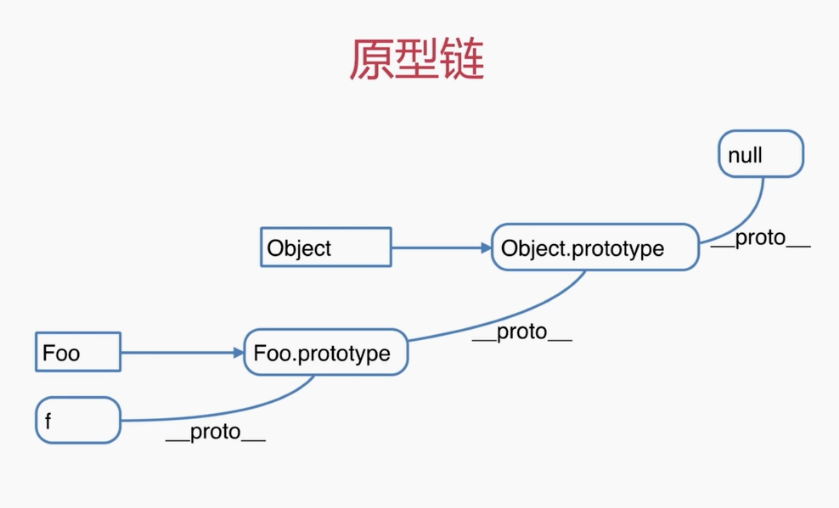
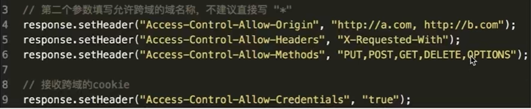

# 《前端 JavaScript 面试技巧》笔记

-  `==` 与 `===`  
    `==` 仅用于判断对象书属性、函数参数是否存在（jQuery 源码推荐写法），其他情况全部用 `===`。
    + `if(obj.x == null){}` 等价于 `f(obj.x === null || obj.x === undefined){}`
    + `function(obj){ if(obj.x == undefined){} }`
- 原型规则
    + 所有的引用类型（对象、数组、函数，`null` 除外），都具有对象特性，即可自由扩展属性。
    + 所有的引用类型（对象、数组、函数，`null` 除外），都有一个 `__proto__` 属性（隐式原型），属性值是一个普通对象。
    + 所有的函数，都有一个 `prototype` 属性（显示原型），属性值是一个普通对象。
    + 所有的引用类型（对象、数组、函数，`null` 除外），`__proto__` 属性指向它构造函数的 `prototype` 属性。  
      `var obj = {}; obj.__proto__ === Object.prototype; // true`
    + 当视图得到一个对象的某个属性时，如果这个对象本身没有这个属性，那么回去它的 `__proto__` 中寻找。
    + 
- `new` 一个对象的过程
    + 创建一个新对象。
    + `this` 指向这个新对象。
    + 执行代码，对 `this` 赋值。
    + 返回 `this`。
- 执行上下文
    + 范围：一段 `<script>` 或者一个函数。
    + 全局：变量定义、函数声明。
    + 函数：变量定义、函数声明、`this`、`arguments`。
- `this`
    + `this` 要在执行时才能确认值，定义时无法确认。
    + 作为构造函数执行。
    + 作为对象属性执行。
    + 作为普通函数执行。
    + `call`、`apply`、`bind`。
- 作用域链
    + 没有块级作用域。
    + 当前作用域没有定义的变量，即：自由变量。
    + 作用域链是指自由变量从父级作用域获取值时形成的链条，即自由变量的查找。
    + 函数的父级作用域是它定义时的作用域，不是执行的作用域。

```javascript
    for (var i = 1; i <= 10; i++) {
        setTimeout(function() { console.log(i) });
    }

    for (var i = 1; i <= 10; i++) {
        (function(i) {
            setTimeout(function() { console.log(i) });
        })(i);
    }

    for (let i = 1; i <= 10; i++) {
        setTimeout(function() { console.log(i) });
    }
```

- 闭包
    + 使用场景：函数作为返回值；函数作为参数传递。
    + 应用场景：用于封装变量，收敛权限；  

```javascript
    // key 生成器
    function keyFactroy(index) {
        var _index = index ? index : 0;
        return function() {
            return _index++;
        }
    }

    var kf = keyFactroy();
    kf(); // 0
    kf(); // 1

    // 判断是否首次出现，隐藏数组权限
    function isFirstLoad() {
        var _list = [];
        return function(val) {
            if (_list.indexOf(val) === -1) {
                _list.push(val);
                return true;
            } else {
                return false;
            }
        }
    }

    var fl = isFirstLoad();
    fl(1); // true
    fl(1); // false
    fl(2); // true
```

- 异步  
    同步会阻塞代码执行，异步不会。
    + 何时需要异步：
        * 在可能发生等待的情况。
        * 等待过程中不能像 `alert` 一样阻塞程序运行。
        * 所有的“等待的情况”都需要异步。
    + 使用异步的场景：
        * 定时任务：`setTimeout`， `setInterval`。
        * 网络请求： `ajax` 请求，动态 `` 加载。
        * 事件绑定。
- DOM & BOM
    + DOM：Document Object Model
    + 浏览器把拿到的 `html` 代码，结构化一个浏览器能够识别并且 JavaScript 可操作的哟个模型。
    + BOM：Browser Object Model，常用的几个对象：
        * `navigator`
        * `screen`
        * `location`
        * `history`
- 事件绑定
    + 事件冒泡
    + 事件代理

```javascript
    // 结合代理的通用事件绑定函数
    function bindEvent(elem, type, selector, fn) {
        if (fn == null) {
            fn = selector;
            selector = null;
        }
        elem.addEventListener(type, function(e) {
            var target;
            if (selector) {
                target = e.target;
                if (target.matches(selector)) {
                    fn.call(target, e);
                }
            } else {
                fn.call(elem, e);
            }
        });
    }
```

- `Ajax`
    + `readyState`：
        * 0：未初始化，还没有调用 `send()` 方法。
        * 1：载入，已调用 `send()` 方法，正在发送请求。
        * 2：载入完成，`send()` 方法执行完成，已经收到全部响应内容。
        * 3：交互，正在解析响应内容。
        * 4：完成，响应内容解析完成，可以在客户端调用回调函数。
    + `status`：
        * 2XX：成功处理请求
        * 3XX：需要重定向
        * 4XX：客户端请求错误
        * 5XX：服务器端错误
    + 过程：

```javascript
        var xhr = new XMLHttpRequest();
        xhr.open('GET', '/api', false);
        xhr.onreadystatechange = function() {
            if (xhr.readyState == 4) {
                if (xhr.status == 200) {
                    console.log('ajax done');
                } else {
                    console.log('ajax error');
                }
            }
        }
        xhr.send();
```

- 跨域
    + 浏览器有同源策略，不允许 `ajax` 访问其他域接口。
    + 跨域条件：协议、域名、端口中有一个不同就算跨域。
    + 3 个标签允许跨域加载资源（浏览器允许）
        * ``
        * `<script src="">`
        * `<link href="">`
    + 3 个标签允许跨域的应用
        * `` 用于打点统计，统计网站可以是其他域。
        * `<script>`、`<link>` 可以使用 CDN。
        * `<script>` 可以用于 `JSONP` 请求。
    + `JSONP` 实现原理：
        * 加载 `<script src="http://test/api.js">` 时，服务器不一定真正有一个 api.js 文件，服务器可以根据请求，动态生成一个文件返回。
        * `<script> window.callback = function(data) { console.log(data) } </script>`
        * `<script src="http://test/api.js"></script>` 服务器返回 `callback({x:1, y:2})`
    + 解决跨域
        * `JSONP`
        * 服务器端设置 http header  
          

- `cookie` `localStorage` `sessionStorage`
    + `cookie`
        * 本身用于客户端和服务器端通信。
        * 它的本地存储功能属于被借用。
        * 缺点：
            - 存储量太小，只有 4KB。
            - 所有 http 请求都会携带，会影响效率。
            - API 简陋，需要封装才能使用，`document.cookie = ...`。
    + `localStorage` 和 `sessionStorage`
        * HTML5 专门为存储设计，最大容量 5M。
        * API 简单易用，`localStorage.setItem(key,value)` `localStorage.getItem(key)`。
        * 使用时建议使用 `try catch` 封装，因为在 iOS safari 隐藏模式中， `localStorage.getItem` 会报错。
        * 测试
        * 测试 dev-branch