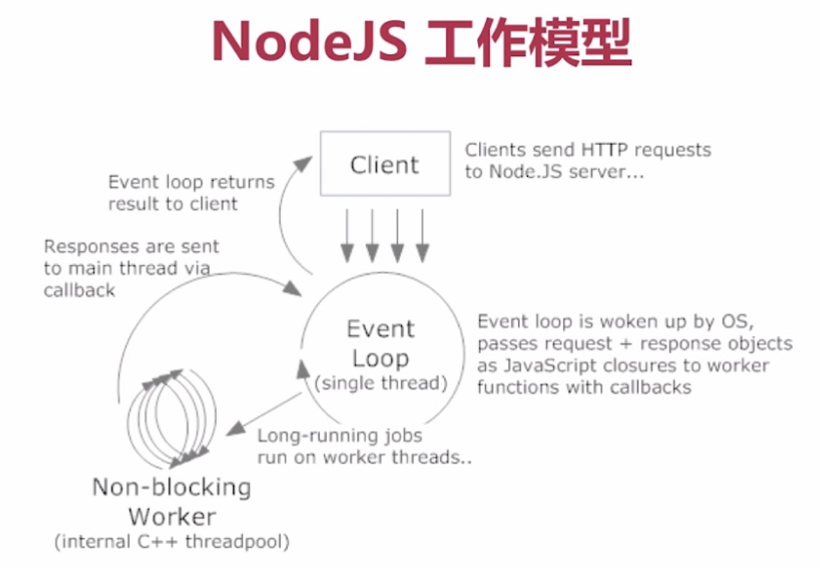

# 《Node.js 入门到企业 Web 开发中的应用》笔记

[[toc]]

## 1.概览

### 1.1 Node.js 几点概念

- Node.js is a JavaScript runtime built on Chrome's V8 JavaScript engine.
- Node.js uses an event-driven, non-blocking I/O model.
- Node.js 在处理高并发、I/O 密集场景性能优势明显。
- Node.js 的单线程只针对主进程，I/O 操作系统底层多线程调度。单线程并不是单进程。多核 CPU 可以启多个线程。
- 

### 1.2 相关概念：

- CPU 密集与 I/O 密集：
    + CPU 密集：压缩、解压、加密、解密
    + I/O 密集：文件操作、网络操作、数据库操作
- 高并发处理：
    + 增加机器数
    + 增加每台机器的 CPU 数 —— 多核
- 进程与线程
    + 进程：是计算机中的程序关于某数据集合上的一次运行活动，是系统进行资源分配和调度的基本单位。
    + 多进程：启动多个进程，读个进程可以一块执行多个任务。
    + 线程：进程内一个相对独立的、可调度的执行单元，与同属一个进程的线程共享进程的资源。
    + 多线程：启动一个进程，在一个进程中启动多个线程，这样，多个线程也可以一块执行多个任务。

## 2.语法概念

### 2.1 ComminJS

- 每个文件是一个模块，有自己的作用域
- 在模块内部 `module` 变量代表模块本身
- `module.exports` 属性代表模块对外接口
- `module.exports === exports`

### 2.2 `require`

`require` 规则

- `/` 表示绝对路径，`./` 表示相当于当前文件相对路径
- 支持 js、json、node 扩展名，不写依次尝试
- 不写路径规则认为是 buil-in 模块或者各级 node_modules 内的第三方模块

`require` 特性

- module 被加载的时候执行，加载后缓存
- 一旦出现某个模块被循环加载，就只输出已执行的部分，还未执行的部分不会输出

```js
// modA.js
module.exports.test = 'A'
const modB = require('./modB.js')
console.log('module A:', modB.test);
module.exports.test = 'AA'

// modB.js
module.exports.test = 'B'
const modA = require('./modA.js')
console.log('module B:', modA.test);
module.exports.test = 'BB'

// main.js
const modA = require('./modA.js')
const modB = require('./modB.js')
console.log(modA.test)
console.log(modB.test)

// node 运行
node main.js
module B: A
module A: BB
AA
BB
```

### 2.3 `exports`

- `exports === module.exports`, `exports` 是 `module.exports` 的快捷方式。
- 但是不能直接重写 `exports` 会改变指向(直接赋值)，关系破坏。

### 2.4 `global`

node 中的全局对象，有一些全局的属性和方法：

- CommonJS
- Buffer process console
- timer

### 2.5 `process`

常用属性：

- `argv`：启动 process 时的参数数组，前两个参数是固定参数
- `execArgv`：在文件名之前的参数，调用 node 的参数
- `execPath`：调用脚本的路径
- `env`：执行环境
- `cwd()`：当前命令执行的路径
- `nextTick()`：将任务放在当前队列的队尾

```js
setImmediate(() => {
    console.log('setImmediate')
});
setTimeout(() => {
    console.log('setTimeout 0')
}, 0);
process.nextTick(() => {
    console.log('nextTick')
})

// nextTick       将任务放在当前队列的队尾
// setTimeout 0   当前队列执行完后立即执行
// setImmediate   将任务放在下一队列的队首，推荐使用
```

### 2.6 调式

仅借助 chrome 就可以完成 node 程序的调试。

- 启动程序时 `node --inspect-brk index.js`
- 在 chrome 中，进入 chrome://inspect 可以 Remote Target 中找到正在调试的程序，点击就可以进入调试模式
- 通过在程序中加入 `debugger` 可以增加断点

## 3.基础 API

阅读官方文档：[英文](https://nodejs.org/api)/[中文](http://nodejs.cn/api)

### 3.1 `path`

常用：

- `normalize()`
- `join()`
- `resolve()`
- `basename()`
- `dirname()`
- `extname()`
- `parse()`
- `format()`
- `win32`
- `posix`

几个路径的区别：

- `__filename`,`__dirname` 总是返回文件的绝对路径
- `process.cwd()` 返回执行 node 命令所在文件夹
- `./`
    + 在 `require()` 中总是相对于当前所在的文件夹
    + 在其他地方和 `process.cwd()` 一样，返回 node 启动文件夹 

### 3.2 `Buffer`
