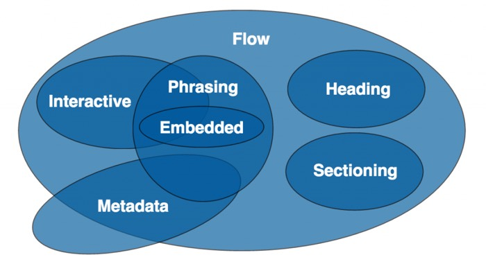
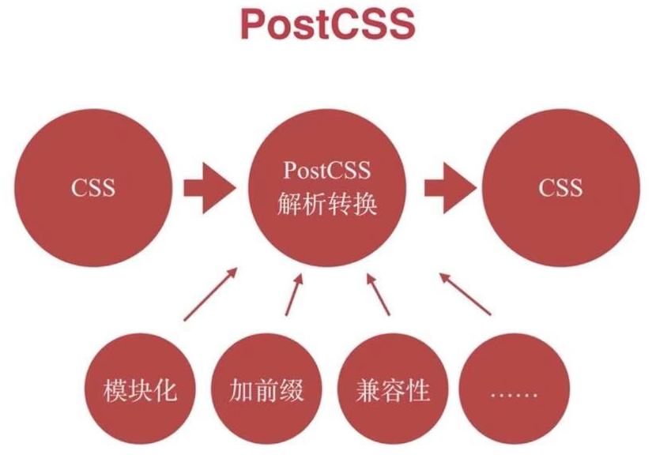

# 《全面系统讲解 CSS 工作应用》笔记

[[toc]]

## 1.HTML 基础强化

### 1.1 HTML 元素分类

HTML4 中，元素根据 CSS 含义来划分为：

- inline(内联元素、行内元素)
- block(块级元素)

但是可以通过 `display` 来改变样式，后来又出现了 `inline-block`，因此这种划分是有些混乱的。

HTML5 中，引入了全新的划分方式：[内容模型(Content Model)](https://html.spec.whatwg.org/multipage/dom.html#content-models)，分为 7 类：



- Metadata：定义文档元数据信息的元素。`base, link, meta, noscript, script, style, template, title`。
- Flow：所有可以放在 `body` 标签内。构成文档内容的元素均属于 Flow 元素。
- Sectioning：页面结构的元素。`article, aside, nav, section`。
- Heading：标题元素。`h1, h2, h3, h4, h5, h6`。
- Phrasing：所有可以放在 `p` 标签内，构成段落内容的元素。Phrasing 元素内部一般只能包含别的 Phrasing 元素。
- Embedded：嵌入外部资源的元素。`audio, video, img, canvas, svg, iframe, embed, object, math`。
- Interactive：与用户交互有关的元素。`a, button, input, textarea, select 等`。

**注**： 特殊的分类：透明内容模型(transparent):内容模型为透明的元素而言，其子元素的合法性由其父元素所决定；如果其父元素的内容模型仍为透明，则查看其祖父元素的情况，并依此类推；典型的具有透明内容模型的元素为 `a` 元素，`<div><a><div>测试</div></a><div>` 是合法嵌套， `<p><a><div>测试</div></a><p>` 是不合法嵌套。

### 1.2 HTML 元素嵌套关系

- 块级元素可以包含行内元素
- 块级元素不一定能包含块级元素
    + e.g. `p` 元素不能包含 `div` 元素
- 行内元素**一般**不能包含块级元素
    + e.g. `a` 元素有时可以包含 `div` 元素，参考 1.1 注。
- 嵌套关系不是简单的用快级、行内来确定，需要使用 HTML5 的内容模型(Content Model)来确定元素嵌套的合法性

### 1.3 题目

- HTML XHTML HTML5 的关系
    + HTML 属于 SGML
    + XHTML 属于 XML，是 HTML 进行 XML 严格化的结果
    + HTML5 不属于 SGML 或 XML，比 XHTML 宽松
- HTML5 的变化
    + 新语义化元素
    + 分类和嵌套关系变更
    + 表单增强（表单验证功能等）
    + 新的 API (离线、音视频、图形、实时通信、本地存储、设备能力)
- 语义化意义
    + 开发者容易理解
    + 机器容易理解（搜索、读屏）
    + 有助于 SEO
    + semantic microdata
- `property` 和 `attribute` 的区别
    + `attribute` 是死的
    + `property` 是活的
- `from` 的作用
    + 直接提交表单
    + 使用 `submit/reset` 按钮
    + 便于浏览器保存表单（保存账户密码）
    + 第三方库可以整体提取值
    + 第三方库可以进行表单验证

## 2.CSS 基础

### 2.1 选择器权重

- 内联样式(`style=""`)：+1000
- id 选择器：+100
- 类、属性、伪类选择器：+10
- 元素、伪元素选择器：+1
- 其他选择器：+0
- `!important` 优先级最高
- 相同权重后写生效
- 权重是非进位计算

### 2.2 非布局样式

- 字体
    + 字体族：serif,sans-serif：具体字体，使用 `""` 括起来，大类不适用引号。
    + 多字体 callback：覆盖面从小到大排列。
    + 网络字体、自定义字体 `@font-face{font-family:'TEST';src:'test.TTF'} .my-text{font-family:'TEST'}`。
    + iconfont：可以利用自定义字体来实现图标。
- 行高
    + 行高构成：简答的说就是有行内最高的 `inline-box` 来决定的。
    + 行高相关现象和方案
        * 单行文字垂直居中：设置 `line-height` 等于容器高度。
        * 行内元素对其：全部设置相同的 `vertical-align`。
        * 图片空隙：`vertical-align` 默认是 `baseline` 对其，所以有空隙，重新设置 `vertical-align`。
    + 行高的调整：`vertical-align`。
- 背景
    + 渐变背景色：`linear-gradient()`
    + 多背景叠加：`background:url("1.jpg") 0 0 no-repeat,url("2.jpg") 200px 0 no-repeat,url("3.jpg") 400px 201px no-repeat;`
    + 雪碧图：`background-position` 等属性，减少请求，减少图片大小
    + base64：小图片直接转换成 css 文件，减少请求，但增加了体积(4/3)
    + 多分辨率适配：`background-size` 放缩图片
- 边框
    + 边框背景图：`border-image`
    + 边框衔接（三角形等）
- 文字折行
    + `overflow-wrap`/`word-wrap`：通用换行控制，是否保留单词。默认长英文单词不折行，`break-word` 长英文单词中间可折行，尽量保证单词完整性。
    + `word-break`：多字节文字，中午句子也是单词,`break-word` 同上、`break-all` 全部折断、`keep-all` 单词全部不折行，包括中文句子。
    + `white-space`：空白处是否换行。`nowrap` 所有文本不折行。
- CSS Hack
    + Hack 是不合法但生效的写法
    + 主要用于区分不同浏览器
    + 缺点：难理解、难维护、易失效
    + 替代方案：特性检查、针对性加 class

### 2.3 题目

- 伪类和伪元素
    + 伪类表示状态
    + 伪元素是真的有元素
    + 伪类是 `:`，伪元素是 `::`

## 3.CSS 布局

### 3.1 常用布局方法

- table 布局
    + 可以直接使用 `<table>` 语义不明确
    + 可以使用 `display: table;` 来达到相同效果

```html
<section>
        <style>
        .table {
            display: table;
            width: 400px;
            height: 200px;
        }

        .table-row {
            display: table-row;
        }

        .table-cell {
            display: table-cell;
            vertical-align: middle;
            text-align: center;
            border: solid 1px #666;
        }
        </style>
        <div class="table">
            <div class="table-row">
                <div class="table-cell">cell1</div>
                <div class="table-cell">cell2</div>
            </div>
        </div>
    </section>
```

- float 布局
    + 特性
        * 元素“浮动”
        * 脱离文档流
        * 但不脱离文本流（对文本有影响，区别于 `position: absolute;` 的完全脱离文档流）
    + 对自身的影响
        * 形成块(BFC)
        * 位置尽量靠上
        * 位置尽量靠左、右
    + 对兄弟元素的影响
        * 不影响其他块级元素位置
        * 影响其他块级元素内的文本
    + 对父元素的影响
        * 从布局上“消失”
        * 父元素高度塌陷
    + 清除浮动
        * 触发 BFC:float、position:absolute/fixed、display:table-cell/table-caption/inline-block、overflow 除了visible 以外的值等
        * 在添加一个高度为 0 的两侧都没有浮动的快级元素，这也是常用的方式。  
        `.clearfix::after {content: ''; display: block; height: 0; clear: both; visibility: hidden; }`

```html
<!-- 三栏布局 -->
<section>
        <style>
        .container {
            width: 800px;
            height: 200px;
        }

        .left {
            float: left;
            width: 200px;
            height: 100%;
            background-color: red;
        }

        .right {
            float: right;
            width: 200px;
            height: 100%;
            background-color: green;
        }

        .middle {
            margin: 0 200px;
            background-color: yellow;
            width: calc(100% - 400px);
            height: 100%;
        }
        </style>
        <div class="container">
            <div class="left">左</div>
            <div class="right">右</div>
            <div class="middle">中</div><!-- 中间在最后，因为如果右在最后，它会尽量靠上，另起一行 -->
        </div>
    </section>
```

- `inline-block` 布局
    + 像文本一样排 `block` 元素
    + 没有清除浮动等问题
    + 需要处理间隙：设置 `font-size: 0;`
    
- flexbox 布局
    + 弹性盒子
    + 盒子本来就是并列的
    + 指定宽度即可

### 3.2 响应式布局

- 在不同设备上正常使用
- 一般主要处理屏幕大小问题（还有其他触摸、外设等问题）
- 主要方法
    + 首先要有响应式设计（源头）
    + 隐藏 + 折行 + 自适应空间
    + viewport + rem + media query
        * rem 换算后会有小数，特别精确的地方可能会出问题
        * media query 在使用时范围大的放上边，范围小的放下边

## 4.CSS 效果

### 4.1 `box-shadow`

- 营造层次感、立体感
- 充当没有宽度的边框 - 做出的边框不会占用宽度
- 特殊效果 - 一个元素画出复杂效果（叮当猫）

### 4.2 `border-radius`

- 圆角矩形
- 圆形 - 圆角为固定值时，加上边框，可能会出现不圆的情况，因为 `width` 变大，最好使用 50%
- 半圆、扇形
- 奇怪的图形 - 水平，垂直可以分别设置圆角

### 4.3 `background`

- 纹理、图案
- 渐变
- 雪碧图动画 - `background-position`
- 背景图尺寸使用 - `background-size`
    + `cover`：图片长宽比不变，等比例缩放，填满容器，超出部分隐藏
    + `contain`：图片长宽比不变，等比例缩放，完整显示，填充容器，不足部分白色

### 4.4 `clip-path`

- 创建一个只有元素的部分区域可以显示的剪切区域。区域内的部分显示，区域外的隐藏,元素所占空间不变
- 对容器进行裁剪
- 常见几何图形
    + `inset`
    + `circle` `ellipse`
    + `polygon`
- 自定义路径，结合svg 使用
- 兼容性有一定问题

### 4.5 3D 变换

- `transform`
    + `translate`：位置移动
    + `scale`：缩放
    + `skew`：倾斜
    + `rotate`：旋转
- `transform-style: preserve-3d;` ：子元素将保留其 3D 位置
- `perspective`：元素距离视图的距离

<demo column>
  <template slot="html">
    <imooc-164-1></imooc-164-1>
  </template>

```html
<section>
    <div class="container">
        <div id="cube">
            <div class="front">1</div>
            <div class="back">2</div>
            <div class="right">3</div>
            <div class="left">4</div>
            <div class="top">5</div>
            <div class="bottom">6</div>
        </div>
    </div>
    <style>
    .container {
        margin: 50px;
        padding: 10px;
        border: 1px solid red;
        width: 200px;
        height: 200px;
        position: relative;
        perspective: 500px;
    }

    #cube {
        width: 200px;
        height: 200px;
        transform-style: preserve-3d;
        transform: translateZ(-100px);
        transition: all .4s;
    }

    #cube div {
        width: 200px;
        height: 200px;
        position: absolute;
        line-height: 200px;
        font-size: 50px;
        text-align: center;
    }

    #cube:hover {
        transform: translateZ(-100px) rotateX(270deg);
    }

    .front {
        transform: translateZ(100px);
        background: rgba(255, 0, 0, .3);
    }

    .back {
        transform: translateZ(-100px) rotateY(180deg);
        background: rgba(0, 255, 0, .3);
    }

    .left {
        transform: translateX(-100px) rotateY(-90deg);
        background: rgba(0, 0, 255, .3);
    }

    .right {
        transform: translateX(100px) rotateY(90deg);
        background: rgba(255, 255, 0, .3);
    }

    .top {
        transform: translateY(-100px) rotateX(-90deg);
        background: rgba(255, 0, 255, .3);
    }

    .bottom {
        transform: translateY(100px) rotateX(90deg);
        background: rgba(0, 255, 255, .3);
    }
    </style>
</section>
```

</demo>

## 5.CSS 动画

### 5.1 动画原理
    
- 视觉暂留作用
- 画面逐渐变化

### 5.2 动画作用

- 增加用户的用户体验 - 愉悦感
- 引起注意、反馈
- 掩饰 - loading

### 5.3 CSS 的动画类型

- `transition` 补间动画
    + `transition-duration`
    + `transition-delay`
    + `transition-timing-function`
        * `linear/ease/ease-in/ease-out/ease-in-out`
        * `cubic-bezier()`
- `keyframe` 关键帧动画
    + 特性
        * 相当于多个补间动画的组合
        * 与元素状态的变换无关（可以自动开始）
        * 定义更加灵活
    + `animation`
        * `animation-name` - `@keyframes` 对应的 name
        * `animation-duration`
        * `animation-delay`
        * `animation-timing-function`
        * `animation-iteration-count` 循环次数，`infinite` 循环播放
        * `animation-play-state` 动画状态，`paused` 暂停，`running` 播放
        * `animation-fill-mode` 动画结束时的状态，`forwards` 保持最后帧，`backwards` 保持第一帧
    + `@keyframes` - 关键帧描述
- 逐帧动画
    + 是关键帧动画的特例
    + 适用于无法补间计算的动画 - 图片组成的动画，但仅适用于动画较小、时长较短时使用，不然会占用大量资源，性能差
    + 使用 `animation-timing-function: steps(1);` 指定过度是只有一帧即不计算补间

### 5.4 CSS 动画性能

- 性能不坏
- 部分情况下优于 JS 动画
- 但 JS 动画可以做到更好 - 可以优化，CSS 动画由于属性简单，几乎无法优化
- 部分高危属性，避免使用
    + `box-shadow` 等

## 6.CSS 预处理器

### 6.1 概要

- 基于 CSS 的另一栋语言
- 通过工具编译成 CSS
- 添加了很多 CSS 不具备的特性
    + 嵌套 反应层级和约束
    + 变量和计算 减少重复代码
    + `extend`, `mixin`
        * `mixin：`：编译后的 CSS 是将相同的 CSS 块复制入不同的选择器中，适用于需要传入参数的复杂情况。
        * `extend`：编译后的 CSS 是将具有相同的 CSS 块的选择器提取出来，公共样式写在一起。CSS 文件更小。
    + 循环 适用于复杂有规律的样式
    + import CSS 文件模块化
- 提升 CSS 文件的组织方式

### 6.2 预处理器框架

- SASS - Compass
- Less - Lesshat/EST
- 提供现成的 mixin
- 类似 JS 类库，封装常用功能（包含兼容性写法等）

## 7.Bootstrap

### 7.1 Bootstrap 4

- 兼容 IE10+
- 使用 flexbox 布局
- 抛弃 Nomaliza.css，改用自己的 reboot
- 提供布局和 reboot 版本

### 7.2 Bootstrap JS 组件的使用方式

- 基于 `data-*` 属性
- 基于 JS API

### 7.3 Bootstrap 定制方法

- 使用 CSS 同名类覆盖
- 修改源码重新构建
- 引用 Sass 源文件 修改变量

## 8.CSS 工程化方案

### 8.1 PostCSS



- PostCSS 本身只有解析能力，以前是后处理器（CSS=>CSS）,现在很多插件的加入，已经模糊了，它作为后处理器的概念(拥有预处理器的能力)
- 各种神奇的特性全靠插件
- 目前至少有 200 多个插件
    + import 模块合并
    + autoprefixier 自动添加前缀
    + cssnano 压缩代码
    + cssnext 使用 CSS 新特性
    + precss 变量、mixin、循环等
- 支持各种构件工具：自身cli、webpack、gulp、grunt、rollup 等

### 8.2 webpack

- JS 是整个应用的核心入口
- 一切都视为资源，均由 JS 管理依赖
- 一切资源均由 webpack 打包

### 8.3 webpack 与 CSS

- css-loader 将 CSS 变成 JS
- style-loader 将 JS 样式插入 head
- ExtractTextPlugin 将 CSS 从 JS 中提取出来
- css modules 解决 CSS 命名冲突问题
- less-loader sass-loader 各种预处理器
- postcss-loader PostCSS 处理

## 9.三大框架中的 CSS

### 9.1 概述

- Angular Vue React 三大框架
- Angular Vue 有内置集成
- React 一些业界实践

### 9.2 ShadowDOM

- 逻辑上的一个 DOM
- 结构上存在子集结构

### 9.3 Scoped CSS

- 限定了范围的 CSS
- 无法影响外部元素
- 外部样式一般不影响内部
- 模拟 Scoped CSS
    + 方案一：随机选择器
        * css modules：在 DOM 中使用对应关系设置样式选择器
    + 方案二：随机属性
        * `<div _abcde />`
        * `div[_abcde]{...}`

### 9.4 Angular

- Angular.js(1.X)：没有样式集成能力
- Angular(2+)：提供了样式封装能力，与组件深度集成
    + `:host(.active){...}`：选择组件宿主元素中的元素
    + `:host-context(.acive) h1{...}`：宿主元素中，再匹配元素
    + `/deep/` 或 `>>>` 穿透：`:host /deep/ h3{...}`
    + `ViewEncapsulation` 样式封装
        * `Emulated`：默认值，模拟 Scoped CSS(方案二)，通过在标签上随机属性，来固定样式的作用域
        * `Native`：使用原生的 Shadow Dom
        * `None`：没有 Shadow Dom，样式没有封装，全局可以使用

### 9.5 Vue

- `<style scoped>`：模拟 Scoped CSS(方案二)
    + 直接使用，无需额外处理
- `<style module>`：模拟 Scoped CSS(方案一)
    + `<style module> .test{...} </style>`：css module 中的 css 样式对应关系，是绑定在当前实例的 `$style` 属性上，即 `this.$style`
    + `<div :class="$style.test"></div>`：使用时，直接写对应关系

### 9.6 React

- 官方没有集成方案
- 社区方案众多
    + css modules：写对应关系
    + (babel) react-css-modules：简化后、直接写选择器
    + styled components：封装成组件
    + styled jsx：直接在 jsx 中写样式