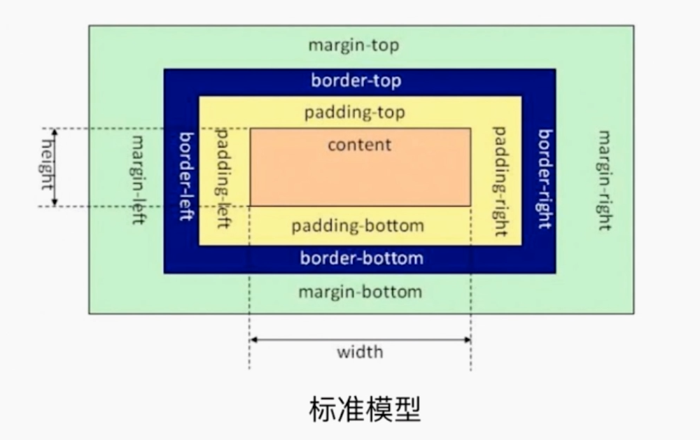
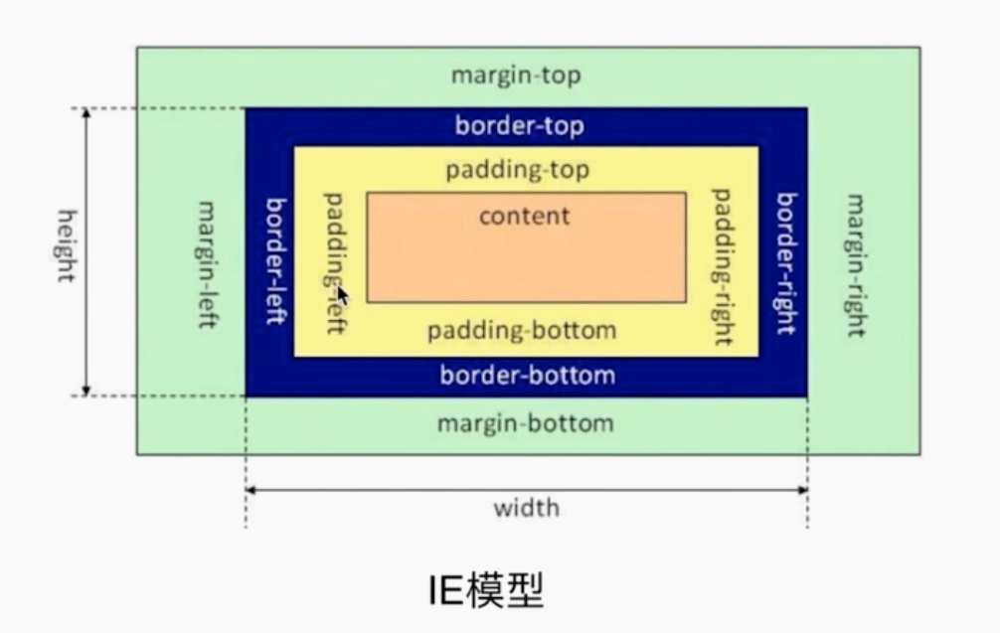
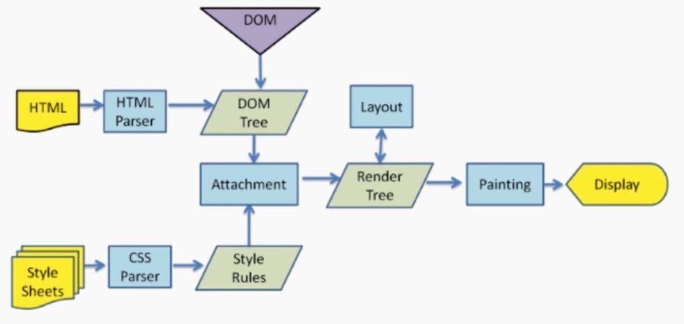

# 《前端 JavaScript 高级面试》笔记

-  CSS 盒模型
    + 标准模型  
      
    + IE 模型  
      
    + 切换两种模型
        * `box-sizing: content-box` 默认值。
        * `box-sizing: border-box`。
    + JS 获取盒模型的宽和高
        * `dom.style.width/height` 只能取得内联样式（`style`）。
        * `dom.currentStyle.width/height` 最终渲染的样式，只有 IE 支持。
        * `window.getComputedStyle(dom).width/height` 最终渲染的样式，兼容性更好。
        * `dom.getBoundingClientRect().width/height` 最终渲染的样式，还可以得到 dom 的绝对位置。
    + 边距重叠几种情况
        * 父子组件。
        * 兄弟组件。
        * 自组件（自身高度或者宽度为 0）。
    + BFC
        * 块级格式化上下文
        * 原理
            - BFC 元素垂直方向边距发生重叠。
            - BFC 区域不会与浮动 box 重叠 - 清楚浮动。
            - BFC 是一个独立的容器，外面、里面的元素互不影响。
            - 计算 BFC 子元素即使是浮动元素也会计算。
        * 创建 BFC
            - `overflow` 不为 `visible`。
            - `float` 不为 `none`。
            - `position` 不为 `static` 或者 `relative`。
            - `display` 设置为为 table 相关时。
        * 应用
            - 清除浮动。
            - 解决边距重叠。
- DOM 事件
    + 事件级别
        * DOM0 `dom.onclick=function(){}`
        * DOM2
            - `dom.addEventLisener('click',function(e){},false)` `true`：在捕获阶段执行,`false`：在冒泡阶段执行。
            - `dom.attachEvent('onclick',function(e){})` IE。
        * DOM3 增加了很多事件类型
    + 事件模型
        * 捕获
        * 冒泡
    + 事件流
        * 点击后，从 window 到达目标元素的捕获阶段。
        * 事件到达目标阶段。
        * 事件从目标元素冒泡到 window 的阶段。
    + 事件捕获的具体流程
        * window -> document -> html(document.documentElement) ->body -> DOM 树 -> 目标元素
        * 冒泡流程相反
    + Event 对象
        * `event.preventDefault()`：阻止默认行为。
        * `event.stopPropagation()`：阻止冒泡。
        * `event.stopImmediatePropagation()`：阻止目标元素的其他事件的执行。
        * `event.target`：当前被点击的元素。
        * `event.currentTarget`：当前绑定事件的元素。
    + 自定义事件

```javascript
        var eve = new Event('myEvent'); // CustomEvent 可以传递参数
        var dom = document.body;
        dom.addEventLisener('myEvent', function(e) {
            console.log(e);
        })

        dom.dispatchEvent(eve);
```

- HTTP 协议
    + HTTP 协议的主要特点
        * 简单快捷
        * 灵活
        * 无连接
        * 无状态（session 与 HTTP 无关）
    + POST 和 GET 区别
        * GET 在浏览器回退时是无害的,而 POST 会再次提交请求。
        * GET 产生的 URL 地址可以被收藏,而 POST 不可以。
        * GET 请求会被浏览器主动缓存,而 POST 不会,除非手动设置。
        * GET 请求只能进行 url 编码,而 POST 支持多种编码方式。
        * GET 请求参数会被完整保留在浏览器历史记录里,而 POST 中的参数不会被保留。
        * GET 请求在 URL 中传送的参数是有长度限制的,而 POST 没有限制。
        * 对参数的数据类型,GET 只接受 ASCII 字符,而 POST 没有限制。
        * GET 比 POST 更不安全,因为参数直接暴露在 URL 上,所以不能用来传递敏感信息。
        * GET 参数通过 URL 传递,POST 放在 Request body 中。
- 前后端如何通信
    + Ajax 同源 
    + WebSocket 非同源
    + CORS 同时支持同源和非同源的标准 - fetch
- 跨域通讯几种方式
    + JSONP
        * 利用 `<script>` 标签允许跨域请求实现的。
    + 通过 Hash
        * 当前页面 A 通过 iframe 或 frame 嵌入跨域的页面 B，B 中通过 `window.onhashchange`来处理。
    + postMessage H5中新增
        * 窗口 A 向跨域的窗口 B 发送信息：`Bwindow.postMessage(data,url)`，在 B 窗口中监听 `window.addEventListener('message',function(e){})`。
    + Webscoket
        * `new WebSocket('ws://')` send onopen onmessage onclose。
    + CORS
        * fetch Promise 直接配置就可以支持跨域。
- 算法
    + 排序
        * [快速排序](https://segmentfault.com/a/1190000009426421)
        * [选择排序](https://segmentfault.com/a/1190000009366805)
        * [希尔排序](https://segmentfault.com/a/1190000009461832)
    + [堆栈、队列、链表](https://juejin.im/entry/58759e79128fe1006b48cdfd)
    + [递归](https://segmentfault.com/a/1190000009857470)
    + 波兰式和逆波兰式
        * [原理](http://www.cnblogs.com/chenying99/p/3675876.html)
        * [源码](https://github.com/Tairraos/rpn.js/blob/master/rpn.js)
- 渲染机制
    + DOCTYPE
        * DOCTYPE 是用来声明文档类型和 DTD(文档类型定义，浏览器用它来判断文档类型) 规范的，用于文档合法性检查。
        * 常用
            - HTML5：`<!DOCTYPE html>`
            - HTML4：有两种，严格模式（不包含展示性和弃用的元素）和传统模式（全部包含）。
    + 浏览器渲染过程
        * 
    + Reflow 重排
        * DOM 结构中的各个元素都有自己的盒子(模型),这些都需要浏览器根据各种样式来计算并根据计算结果将元素放到它该出现的位置,这个过程称之为 Reflow。
        * 触发 Reflow
            - 当你增加、删除、修改 DOM 节点时,会导致 Reflow 或 Repaint。
            - 当你移动 DOM 的位置,或是搞个动画的时候。
            - 当你修改 CSS 样式的时候。
            - 当你 Resize 窗口的时候(移动端没有这个问题),或是滚动的时候。
            - 当你修改网页的默认字体时。
    + Repaint 重绘
        * 当各种盒子的位置、大小以及其他属性,例如颜色、字体大小等都确定下来后,浏览器于是便把这些元素都按照各自的特性绘制了一遍,于是页面的内容出现了,这个过程称之为 Repaint。
        * 触发 Repaint
            - DOM 改动
            - CSS 改动
- 运行机制
    + 同步任务、异步任务
        * 异步任务
            - `setTimeout`、`setInterval`
            - DOM 事件
            - `Promise`
    + 同步队列、异步队列
- 错误监控
    + 前端错误分类
        * 即时运行错误：代码错误
            - 捕获方式：
                + `try..catch`
                + `window.onerror`
        * 资源加载错误
            - 捕获方式：
                + `object.onerror`
                + `performance.getEntries()` 成功加载资源的集合
                +  Error 事件捕获，`window.addEventListener('error',function(){},true)`
    + 上报错误基本原理
        * 利用 Ajax 上报。
        * 利用 Image 对象上报。 `(new Image()).src = 'http://baidu.com/test?123';`
- 创建对象几种方式
    + `var obj = {x:1}`
    + `var obj = new Object({x:1})`
    + `function Test(){...} var obj = new Test()`
    + `var obj = Object.create({x:1})`
    + `var obj = Object.assign({x:1})`
- 创建对象的多种方法总结
    + 工厂模式
        * 缺点：对象无法识别。
    + 构造函数
        * 缺点：方法属性会在每个实例中重新创建一个，浪费资源。
    + 原型模式
        * 缺点：引用类型的属性被所有实例共享。
    + 组合继承（最常见）
        * 构造函数设置属性
        * 原型链设置方法
    + class（最推荐）
- 继承的多种方法总结
    + 借用构造函数继承
        * 缺点：方法属性会在每个实例中重新创建一个，浪费资源。
    + 原型链继承
        * 缺点：引用类型的属性被所有实例共享。
    + 组合继承（最常见）
        * 构造函数继承属性
        * 原型链继承方法
    + extends（最推荐）