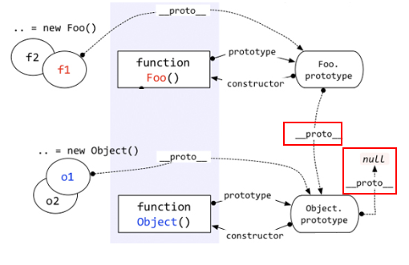
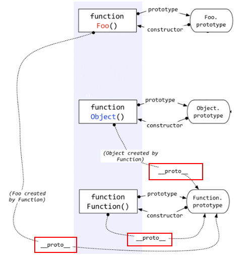

# 原型与原型链

[[toc]]

## 1.原型

### `prototype`

每创建一个函数，该函数都有一个 `prototype` 属性，该属性的值是一个对象，我们把它叫做该函数的原型对象，这个对象默认有一个 `constructor` 属性，该属性指向该函数本身。

```js
function Foo() {};
Foo.prototype.constructor === Foo; // true
let f1 = new Foo();
```

### `__proto__`

首先明确 2 个点前置知识：

- 函数是一种特殊的对象。
- 对象都是通过函数来创建的（一些语法糖弱化了这个概念）。
    + `let obj = {}` 实质是 `let obj = new Object()`。
    + `let arr = []` 实质是 `let arr = new Array()`。
    + `function f(){}` 实质是 `let f = new Function()`。

每创建一个对象（`null`除外），该对象都有一个隐藏属性 `__proto__`(`[[prototype]]`)，叫做隐式原型，该属性指向了创建这个对象的函数的 `prototype`属性（即该函数的原型对象）。即 `f1.__proto__ === Foo.prototype // true`。

注意几点：

- `__proto__`是部分浏览器的内部属性，node 中没有这个属性，故要在使用实例的原型时，使用 `Object.getPrototypeOf(f1)` 来代替 `__proto__`。
- 自定义函数的 `prototype` 本质上就是和 `var obj = new Object()` 是一样的（函数是一种特殊的对象），都是被 `Object` 创建，所以它的 `__proto__` 指向的就是 `Object.prototype`，即 `Foo.prototype.__proto__ === Object.prototype // true`。
- `Object.prototype` 确实一个特例，它的 `__proto__` 指向的是 `null`，即 `Object.prototype.__proto__ === null // true`。



- 函数也是一种对象，所以函数也有 `__proto__`，函数对象是由`Function`函数创建出来的，故 `Foo.__proto__ === Function.prototype // true`。
- `Object` 也是函数，故 `Object.__proto__ === Function.prototype // true`。
- `Function` 也是一个函数，函数是一种对象。既然是函数，那么它一定是被 `Function` 创建。所以 `Function` 是被自身创建的。所以它的 `__proto__` 指向了自身的 `Prototype`，即 `Function.__proto__ === Function.prototype // true`。



## 2.原型链

访问一个对象的属性时，先在基本属性中查找，如果没有，再沿着 `__proto__` 这条链向上找，这就是原型链。

```js
function Foo() {}
Foo.prototype.a = 1;
Foo.prototype.b = 2;

let f1 = new Foo();
f1.a = 10;

for (let item in f1) {
    if (f1.hasOwnProperty(itme)) {
        console.log(item);
    }
}
```


对象的原型链是沿着 `__proto__` 这条线走的，因此在查找 `f1.hasOwnProperty` 属性时，先在自身查找，自身没有；再到 `Foo.prototype` 中查找，没有找到；就会顺着原型链一直查找到 `Object.prototype`，这样我们就通过原型链实现了所谓的“继承”。

***
参考：  
[深入理解javascript原型和闭包系列](http://www.cnblogs.com/wangfupeng1988/tag/%E5%8E%9F%E5%9E%8B/)