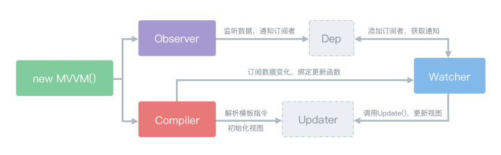
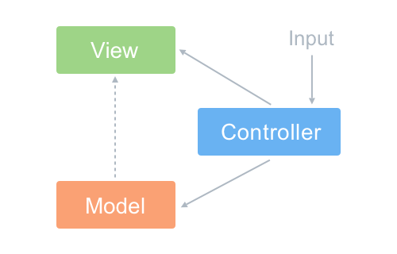
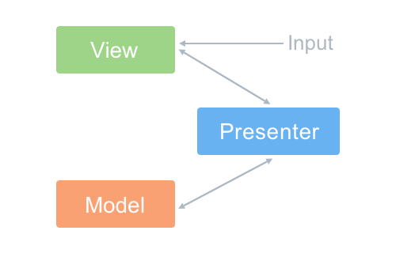
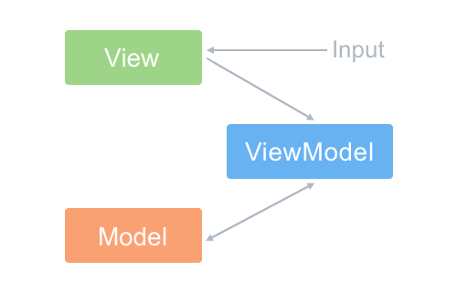

# 面试知识点梳理

[[toc]]

## 1.HTML

### 1.1 HTML 元素分类

- HTML4 中，元素根据 CSS 含义来划分为
    + inline(内联元素、行内元素)
    + block(块级元素)
    + 但是可以通过 `display` 来改变样式，后来又出现了 `inline-block`，因此这种划分是有些混乱的
- HTML5 中，引入了全新的划分方式：[内容模型(Content Model)](https://html.spec.whatwg.org/multipage/dom.html#content-models)，分为 7 类：
    + Metadata：定义文档元数据信息的元素。`base, link, meta, noscript, script, style, template, title`。
    + Flow：所有可以放在 `body` 标签内。构成文档内容的元素均属于 Flow 元素。
    + Sectioning：页面结构的元素。`article, aside, nav, section`。
    + Heading：标题元素。`h1, h2, h3, h4, h5, h6`。
    + Phrasing：所有可以放在 `p` 标签内，构成段落内容的元素。Phrasing 元素内部一般只能包含别的 Phrasing 元素。
    + Embedded：嵌入外部资源的元素。`audio, video, img, canvas, svg, iframe, embed, object, math`。
    + Interactive：与用户交互有关的元素。`a, button, input, textarea, select 等`。
- HTML 元素嵌套关系
    + 块级元素可以包含行内元素
    + 块级元素不一定能包含块级元素
        * e.g. `p` 元素不能包含 `div` 元素
    + 行内元素**一般**不能包含块级元素
        * e.g. `a` 元素有时可以包含 `div` 元素，参考 1.1 注。
    + 嵌套关系不是简单的用快级、行内来确定，需要使用 HTML5 的内容模型(Content Model)来确定元素嵌套的合法性

### 1.2 四大 Web 组件标准

+ HTML Template
+ Shadow DOM
    * 也是 DOM 的一种，是一种特殊的子树，它能创建一个相对独立（可以从父节点继承属性）的空间。
    * 利用这点就可以创建原生的组件。
    * 浏览器中已有通过 Shadow DOM 实现的组件：`<input>`、`<select>`、`<video>` 等。
    * Shadow Root 是 Shadow DOM 的跟节点，可以在普通 DOM 上使用 `attachShadow(mode:'open')`  来创建一个 Shadow Root。
+ Custom Elements
+ HTML Imports
+ 利用前 3 点实现的组件封装是就是 Web Components
    * Atag 淘宝前端团队
    * Omit 腾讯前端团队

## 2.CSS

### 2.1 BFC

* 块级格式化上下文
* 原理
    - BFC 元素垂直方向边距发生重叠。
    - BFC 区域不会与浮动 box 重叠 - 清楚浮动。
    - BFC 是一个独立的容器，外面、里面的元素互不影响。
    - 计算 BFC 子元素即使是浮动元素也会计算。
* 创建 BFC
    - `overflow` 不为 `visible`。
    - `float` 不为 `none`。
    - `position` 不为 `static` 或者 `relative`。
    - `display` 设置为为 table 相关时。
* 应用
    - 清除浮动。
    - 解决边距重叠。

### 2.2 CSS 的动画类型

- `transition` 补间动画
- `keyframe` 关键帧动画
- 逐帧动画
    + 关键帧动画的特例
    + 适用于无法补间计算的动画 - 图片组成的动画，但仅适用于动画较小、时长较短时使用，不然会占用大量资源，性能差
    + 使用 `animation-timing-function: steps(1);` 指定过度是只有一帧即不计算补间

### 2.3 响应式布局

- 在不同设备上正常使用
- 一般主要处理屏幕大小问题（还有其他触摸、外设等问题）
- 主要方法
    + 首先要有响应式设计（源头）
    + 隐藏 + 折行 + 自适应空间
    + viewport + rem + media query
        * rem 换算后会有小数，特别精确的地方可能会出问题
        * media query 在使用时范围大的放上边，范围小的放下边

### 2.4 移动端适配

- 基本概念
    + [css 像素、逻辑像素、设备像素、设备像素比](https://github.com/jawil/blog/issues/21)
        * css 像素(css pixels)：是就通常的 px 为单位的像素
        * 逻辑像素：就是 css 像素
        * 设备像素：就是设备的真是物理像素
        * 设备像素比（dpr）：是 设备像素（物理像素）与 css 像素与的比值。假设 retina 屏幕的 dpr = 2，也就是 css 中宽为 100px 的样式是由 200 个物理像素点构成的。
    + viewport
        * `<meta name="viewport" content="width=device-width,initial-scale=1.0">`
        * viewport 分三类
            - visual viewport 可视页面的宽度
            - layout viewport 真实页面宽度
            - ideal viewport 设备理想的宽度
        * `width=device-width` => layout viewport = ideal viewport
    + rem
        * rem 的 `font-size` 根据根元素（`<html>`）计算
        * em 是根据父元素计算
    + vw
        * vw 相对于视窗宽度的单位，随宽度变化而变化
- 方案一：rem
    + 原理
        * 利用 viewport 和设备像素比调整基准像素：所有样式使用 rem 为单位，将 dpr 比例结合 font-size 用 js 进行设置，就可以实现统一的自适应 
        * 将 px 单位的样式转化成 rem 单位：利用 px2rem/postcss-pxtorem 自动转换 css 像素
    + 解决方案
        * [hotcss](https://github.com/imochen/hotcss)
        * [amfe-flexible](https://github.com/amfe/lib-flexible)
    + 兼容性：非常好
- 方案二：vw
    + 原理
        * 与 rem 类似做法，直接使用 postcss-px-to-viewport 插件进行配置, 配置方式也是和 postcss-pxtorem 大同小异
    + 兼容性：较好，只有低版本的 safari 情况下会有兼容性问题

### 2.5 CSS 模块化

- 命名约定
    + 该类 CSS 模块化方案主要用来规范 CSS命名，最常见的是 BEM、OOCSS 等，在构建工具出现之前，大多数都是在 CSS 命名上做文章。
- CSS in JS
    + 彻底抛弃 CSS，用 javascript 来写 CSS 规则，常见的有 styled-components。
- 使用 JS 来管理样式
    + 使用 JS 编译原生的 CSS 文件，使其具备模块化的能力，最常见的就是 CSS Modules

### 2.6 三大框架中的 CSS

- Scoped CSS
    + 限定了范围的 CSS
    + 无法影响外部元素
    + 外部样式一般不影响内部
    + 模拟 Scoped CSS
        * 方案一：随机选择器
            - css modules：在 DOM 中使用对应关系设置样式选择器
        * 方案二：随机属性
            - `
`
            - `div[_abcde]{...}`
- Angular
    + Angular.js(1.X)：没有样式集成能力
    + Angular(2+)：提供了样式封装能力，与组件深度集成
        * `:host(.active){...}`：选择组件宿主元素中的元素
        * `:host-context(.acive) h1{...}`：宿主元素中，再匹配元素
        * `/deep/` 或 `>>>` 穿透：`:host /deep/ h3{...}`
        * `ViewEncapsulation` 样式封装
            - `Emulated`：默认值，模拟 Scoped CSS(方案二)，通过在标签上随机属性，来固定样式的作用域
            - `Native`：使用原生的 Shadow Dom
            - `None`：没有 Shadow Dom，样式没有封装，全局可以使用
- Vue
    + ``：css module 中的 css 样式对应关系，是绑定在当前实例的 `$style` 属性上，即 `this.$style`
        * `

`：使用时，直接写对应关系
- React
    + 官方没有集成方案
    + 社区方案众多
        * css modules：写对应关系
        * (babel) react-css-modules：简化后、直接写选择器
        * styled components：封装成组件
        * styled jsx：直接在 jsx 中写样式
        
## 3.JavaScript

### 3.1 原型、 原型链

- 原型对象：`Foo.prototype.constructor === Foo`：每创建一个函数，该函数都有一个 `prototype` 属性，该属性的值是一个对象，我们把它叫做该函数的原型对象，这个对象默认有一个 `constructor` 属性，该属性指向该函数本身。
- 隐式原型：`foo.__proto__ === Foo.prototype`：每创建一个对象（`null`除外），该对象都有一个隐藏属性 `__proto__`(`[[prototype]]`)，叫做隐式原型，该属性指向了创建这个对象的函数的 `prototype`属性（即该函数的原型对象）
- 原型链：访问一个对象的属性时，先在基本属性中查找，如果没有，再沿着 `__proto__` 这条链向上找，这就是原型链。
- 其他：
    + `Foo.prototype.__proto__ === Object.prototype`：对象是由 Object 函数创建的
    + `Object.prototype.__proto__ === null`：特例
    + `Foo.__proto__ === Function.prototype`：函数也是对象
    + `Object.__proto__ === Function.prototype`：Object 是函数，也是对象
    + `Function.__proto__ === Function.prototype`：Function 是函数，也是对象，一定是被 Function 创建 =》 Function 是被自身创建的

### 3.2 创建对象的多种方法总结

- 工厂模式：对象无法识别
- 构造函数：方法属性会在每个实例中重新创建一个，浪费资源
- 原型模式：引用类型的属性被所有实例共享
- 组合模式（最常见方式）：封装性看起来比较困惑，分散在构造函数与原型两部分
- 寄生(parasitic)构造函数：特殊情况下使用，例如想创建一个具有额外方法的特殊数组（修改原生、既有对象）
- class（最推荐方式）：是 ES6 中对象模板，是一个语法糖

### 3.3 继承的多种方法总结

- 借用构造函数/经典继承：方法属性会在每个实例中重新创建一个，浪费资源
- 原型链继承：用类型被所有实例共享
- 组合继承/伪经典继承（最常见方式）
    + ES5：先创造子类的实例对象 `this`，然后再将父类的方法添加到 `this` 上面（`Parent.apply(this)`）
- extends（最推荐方式）
    + ES6：先有父类实例对象的属性和方法，加到 `this` 上面（所以必须先调用 `super` 方法），然后再用子类的构造函数修改 `this`。因此只有调用 `super` 之后，才可以使用 `this` 关键字，否则会报错。

### 3.4 `new` 一个对象的过程

- 创建一个新对象。
- `this` 指向这个新对象。
- 执行代码，对 `this` 赋值。
- 返回 `this`。

### 3.5 `this`
- `this` 要在执行时才能确认值，定义时无法确认。
- 作为构造函数执行。
- 作为对象属性执行。
- 作为普通函数执行。
- `call`、`apply`、`bind`。

### 3.6 作用域链
- 没有块级作用域。
- 当前作用域没有定义的变量，即：自由变量。
- 作用域链是指自由变量从父级作用域获取值时形成的链条，即自由变量的查找。
- 函数的父级作用域是它定义时的作用域，不是执行的作用域。

### 3.7 闭包
- 使用场景：函数作为返回值；函数作为参数传递。
- 应用场景：用于封装变量，收敛权限；  

### 3.8 事件

- 事件级别
    + DOM0：`dom.onClick = function(){}`
    + DOM1：没有事件模型
    + DOM2：
        * `dom.addEventListener('click',function(){},false)` false：冒泡；true：捕获
        * `dom.attachEvent('onclick',function(){})`
    + DOM3：增加事件
- 事件模型：
    + 捕获：window =》 target
    + 冒泡：target =》 window
- 事件流：
    + 点击后，从 window 到达目标元素的捕获阶段。
    + 事件到达目标阶段。
    + 事件从目标元素冒泡到 window 的阶段。
- 自定义事件
    + `new Event()`
    + `dispatchEvent()`

### 3.9 防抖、节流

- 防抖：高频操作在某个时限内，只响应一次。
- 节流：高频操作，段时间内大量触发，降低触发回调的频率，回调执行多次

### 3.10 `async`

- 概念
    + `async` 就是 Generator / Promise 函数的语法糖。
    + `async` 函数始终返回的是一个 Promise 对象。
    + `await` 等待的是一个表达式，这个表达式的计算结果是 Promise 对象或者其它值。如果它等到的是一个 Promise 对象，它会阻塞后面的代码（**代码串行化**），等着 Promise 对象 `resolve`，然后得到 `resolve` 的值，作为 `await` 表达式的运算结果。
    + `await` 必须用在 `async` 函数中。`async` 函数调用不会造成阻塞，它内部所有的阻塞都被封装在一个 Promise 对象中异步执行。
- 优点
    + 同步的编程风格。
    + `async` 声明的方法，返回 Promise 对象，可以安全的使用 `.then(...)` 或者 `await`。
- 错误处理
    + `try...catch`：标准写法；块中的所有异常都将捕获，不仅仅是异步的错误
    + 改造 Promise 使其同时返回错误和结果：类似 Node 错误处理方式
    + 在 Promise 后继续使用 `.catch()` 来处理错误：错误优先政策处理，不直观
- 串行与并行
    + 由于 `await` 的特性，使得在不特殊处理时代码串行化
    + 并行处理
        * Promise.all
        * 引用执行

### 3.11 JS 模块化

+ 命名空间
    * 库名.类别名.方法名
    * 容易命名冲突，覆盖
    * 必须知晓具体命名，才能使用方法
+ CommonJS
    * 一个文件为一个模块
    * 通过 `module.exports` 暴露模块接口
    * 通过 `require` 引入模块
    * 同步执行
+ AMD
    * Async Module Definition
    * 使用 `define` 定义模块
    * 使用 `require` 加载模块
    * RequireJS
    * 依赖前置，提前执行（与 CMD 重要区别）
+ CMD
    * Common Module Definition
    * 一个文件为一个模块
    * 使用 `define` 定义模块
    * 使用 `require` 加载模块
    * SeaJS
    * 尽可能懒执行（与 AMD 重要区别）
+ UMD
    * Universal Module Definition
    * 通用解决方案
    * 三步骤
        - 判断是否支持 AMD
        - 判断是否支持 CommonJS
        - 如果都不支持，使用全局变量 - 命名空间
+ ES6 module
    * EcmaScripte Module
    * 一个文件为一个模块
    * `export` `import`
+ Webpack 支持的模块化方式
    * AMD(RequireJS)
    * ES Module(推荐)
    * CommonJS

## 4.Vue 

### 4.1 Vue 2.+ 原理

- 双向数据绑定-数据劫持
    + `Object.defineProperty` IE9+ 提供给属性 `getter` 和 setter 方法。
    + 不足：
        + 数组的 push/pop 等操作
        + 不能监测数组 length 长度的变化
        + 数组的 arr[xxx] = yyy 无法感知
        + 对象属性的添加和删除无法感知
    + 改进
        + 对数组方法进行变异
        + 增加 `$set` 、`$delete` 进行属性的添加、删除
- 双向数据绑定-观察者模式
    * 观察者订阅了可观察对象，当可观察对象发布事件，则就直接调度观察者的行为，所以这里观察者和可观察对象其实就产生了一个依赖的关系。与发布订阅模式略有不同，发布订阅有一个事件分发调度中心。
    * 3个关键的类
        * Observer：主要用于给 Vue 的数据 `defineProperty` 增加 `getter/setter` 方法，并且在 `getter/setter`中收集依赖/通知依赖更新
        * Watcher：观察数据（或者表达式）变化然后执行回调函数
        * Dep：一个处理依赖关系的对象，主要起到一个纽带的作用
- 
- `computed` 原理
    + 初始化 data和computed,分别代理其set以及get方法, 对data中的所有属性生成唯一的dep实例。
    + 对computed中的reversedMessage生成唯一watcher,并保存在vm._computedWatchers中
    + 访问 reversedMessage，设置Dep.target指向reversedMessage的watcher,调用该属性具体方法reversedMessage。
    + 方法中访问this.message，即会调用this.message代理的get方法，将this.message的dep加入reversedMessage的watcher,同时该dep中的subs添加这个watcher
    + 设置vm.message = 'World'，调用message代理的set方法触发dep的notify方法'
    + 因为是computed属性，只是将watcher中的dirty设置为true
    + 最后一步vm.reversedMessage，访问其get方法时，得知reversedMessage的watcher.dirty为true,调用watcher.evaluate()方法获取新的值。
    + - _init => initState => 
        - initData => new Observer => defineReactive => new Dep,getter:dep.depend(Watcher);setter:dep.notify()
        - initComputed => new Watcher(dirty,lazy=true) => defineComputed => getter:evaluate()
- Vuex 原理
    + 高度依赖于vue的computed依赖检测系统以及其插件系统，
    + applyMixin方法，该方法主要作用就是在所有组件的beforeCreate生命周期注入了设置this.$store这样一个对象
    + resetStoreVM => 其本质就是将我们传入的state作为一个隐藏的vue组件的data,也就是说，我们的commit操作，本质上其实是修改这个组件的data值，结合上文的computed,修改被defineReactive代理的对象值后，会将其收集到的依赖的watcher中的dirty设置为true,等到下一次访问该watcher中的值后重新获取最新值。
    + 最后一句话结束vuex工作原理，vuex中的store本质就是没有template的隐藏着的vue组件；

### 4.2 Vue 实例初始化

- init 函数
    + vm 生命周期的相关变量初始化
    + vm 事件相关初始化
    + 模板开始解析
    + `beforeCreate` 钩子函数
    + vm 状态初始化
        * `props`
        * `methods`
        * `data`
        * `computed`
        * `watch`
- `created` 钩子函数
    + 实例创建完成
    + 但未挂载到 DOM 中，`$el`、`$ref`不能访问
- `beforeMount` 钩子函数
    + 在挂载开始之前被调用
    + 找到对应的 `template`，并编译成 `render` 函数
- `mounted` 钩子函数
    + 实例挂载到 DOM 上，`$ref` 属性可以访问
- `beforeUpdate`
    + 响应式数据更新时调用，发生在虚拟 DOM 打补丁之前
- `updated`
    + 虚拟 DOM 重新渲染和打补丁之后调用，组件 DOM 已经更新，可执行依赖于 DOM 的操作
- `beforeDestroy`
    + 实例销毁之前调用。这一步，实例仍然完全可用
- `destroyed`
    + 实例销毁后调用，调用后，Vue 实例指示的所有东西都会解绑定，所有的事件监听器会被移除，所有的子实例也会被销毁

### 4.3 Vue 组件间通信几种方式

- `props`
    + 父组件向子组件传递值（数组、对象、方法）
- `$emit`
    + 子组件向父组件传值（通过事件形式）
- eventBus（`$emit` 和 `$on`）
    + 任意组件间通讯（父子、兄弟、跨级）
    + 通过一个空的 Vue 实例作为中央事件总线，用它来触发事件和监听事件，可以实现任意组件间通讯（父子、兄弟、跨级）  
    + 缺点：太多的事件会造成混乱，因为触发和监听分散在各种组件中。
- Vuex
    + 任意组件间通讯（父子、兄弟、跨级）
    + Vuex 是一个状态管理模式。它采用集中式存储管理应用的所有组件的状态，并以相应的规则保证状态以一种可预测的方式发生变化。 Vuex 实现了一个单向数据流，在全局拥有一个 State 存放数据，当组件要更改 State 中的数据时，必须通过 Mutation 进行，Mutation 同时提供了订阅者模式供外部插件调用获取 State 数据的更新。而当所有异步操作或批量的同步操作需要走 Action，但 Action 无法直接修改 State，需要通过 Mutation 来修改 State 的数据。最后，根据 State 的变化，渲染到视图上。 
- `provide` 和 `inject`
    + 多层组件间通讯（父子孙）,祖先组件向其所有后代注入一个依赖，始终生效。Vue 2.2 版本引入的新方式
    + provide 和 inject 绑定并不是可响应的。当你传入了一个可监听的对象，那么其对象的属性还是可响应的。
- `$attrs` 和 `$listeners`
    + 多层组件间通讯（父子孙）。Vue 2.4 版本引入的新方式
    + `$attrs`：包含了父作用域中不作为 `prop` 被识别 (且获取) 的特性绑定 (`class` 和 `style` 除外)
    + `$listeners`：包含了父作用域中的 (不含 `.native` 修饰器的) `v-on` 事件监听器
- `$refs`, `$parent`, `$children`, `$root`
    + 可以直接访问组件示例，然后直接调用组件的方法和访问数据
- 作用域插槽
    + 父组件的插槽中，通过作用域插槽和插槽 prop，可以访问子组件中的数据。

### 4.4 vDOM

- 在 `render` 生成，vDOM => creatElement => DOM
- `patch` 算法：对比新旧 DOM 节点，找出需要更新的节点，再更新（打补丁）
- 优势
    + 减少 DOM 操作
    + 跨平台能力

### 4.5 Vue Diff 算法

- `patch(old, vNode)`
- 只在同级比较
- 不同，直接整个节点(包括子节点)替换
- 相同，子节点比较
- 找到真实 DOM 与 vNode, old 比较
- `updateChildren`

### 4.6 Vue Router 守卫

- 全局
    + `beforeEach(to, from, next)`
    + `beforeResolve`：在导航被确认之前，同时在所有组件内守卫和异步路由组件被解析之后，解析守卫就被调用
    + `afterEach(to, from)`
- 独享(路由配置)
    + `beforeEnter`
- 组件内
    + `beforeRouteEnter(to, from, next)`：不能访问 `this`,可以通过回调 `next` 来访问组件示例
    + `beforeRouteUpdate(to, from, next)`
    + `beforeRouteLeave(to, from, next)`
- 导航解析流程
    + 导航被触发。
    + 在失活的组件里调用离开守卫 `beforeRouteLeave`。
    + 调用全局的 `beforeEach` 守卫。
    + 在重用的组件里调用 `beforeRouteUpdate` 守卫 (2.2+)。
    + 在路由配置里调用 `beforeEnter`。
    + 解析异步路由组件。
    + 在被激活的组件里调用 `beforeRouteEnter`。
    + 调用全局的 `beforeResolve` 守卫 (2.5+)。
    + 导航被确认。
    + 调用全局的 `afterEach` 钩子。
    + 触发 DOM 更新。
    + 用创建好的实例调用 `beforeRouteEnter` 守卫中传给 next 的回调函数。

## 5.前端工程化

### 5.1 CSS 工程化

- PostCSS
    + PostCSS 本身只有解析能力，以前是后处理器（CSS=>CSS）,现在很多插件的加入，已经模糊了，它作为后处理器的概念(拥有预处理器的能力)
    + 各种神奇的特性全靠插件
    + 目前至少有 200 多个插件
        * import 模块合并
        * autoprefixier 自动添加前缀
        * cssnano 压缩代码
        * cssnext 使用 CSS 新特性
        * precss 变量、mixin、循环等
    + 支持各种构件工具：自身cli、webpack、gulp、grunt、rollup 等
- webpack 与 CSS
    + css-loader 将 CSS 变成 JS
    + style-loader 将 JS 样式插入 head
    + ExtractTextPlugin 将 CSS 从 JS 中提取出来
    + css modules 解决 CSS 命名冲突问题
    + less-loader sass-loader 各种预处理器
    + postcss-loader PostCSS 处理

### 5.2 webpack 与 grunt/gulp

- 相同点：都可以用于项目打包、文件压缩、文件监测等。
- webpack 是一个模块打包器（module bundler），他可以递归的打包项目中的所有模块，最终生成几个打包好的文件。他支持 code-splitting(代码分割)、模块化(AMD,ESM,CommonJS)、全局模块化。主要侧重于模块的打包，适合于单页面的项目，开发中的所有资源（图片、js、css 等）都看成模块，通过 loader 和 plugins 对资源进行处理，打包成符合生产环境部署的前端资源。
- grunt/gulp 是自动化构建工具（tast runner），就是用来代替手工执行机械重复的事情。侧重于前端开发的工作流程，通过配置一系列的task，定义执行顺序，从而构建项目的整个前端开发流程。

### 5.3 什么是长缓存，在 webpack 中如何做到长缓存优化

- 浏览器在用户访问页面时，为了加快加载速度，会对用户访问的静态资源进行存储。但是每次更新、代码升级，都需要浏览器重新下载新的代码，最简单的更新方式就是引入新的文件名称。
- 在 webpack 中可以在 output 中给输出文件指定 filename 为 chunkhash
- 分类业务代码和框架代码（引入第三方模块、webpack runtime、等）
- 通过 NamedModulesPlugin 或 HashedModuleIdsPlugin 使得没有更新的业务代码文件名不变

### 5.4 webpack3 与 webpack4

+ 新增 mode
    * production 默认开起了很多代码优化（minify, splite）
    * development
    * none 取消所有默认设置
+ 移除 CommonsChunkPlugin，变更为 optimization.splitChunks，optimization.runtimeChunk
+ ExtractTextWebpackPlugin 调整，建议使用新的 CSS 提取插件 mini-css-extract-plugin
+ 支持 ES 6的方式导入 JSON 文件

### 5.5 webpack 中的几个概念

- Entery 代码入口，打包入口，单个或者多个（多页面程序等）
- Output 打包成的文件（bundle），单个或者多个，自定义规则
- Loaders 处理文件（除去 js 以外的其他文件），将文件转化成模块（js 可以识别的模块）
- Plugins 参与打包整个过程，打包优化和压缩，配置编译时的变量，极其灵活
- module 是开发中的单独模块
- chunk 是 webpack 在进行模块依赖分析时，代码分割出来的代码块，最终打包成 bundle
- bundle 是 webpack 打包出来的文件
- loader 是告诉 webpack 如何转化处理某一类型的文件，并且引入到打包出的文件中
- plugin 是自定义 webpack 打包过程的方式，一个插件是包含 apply 方法的一个对象，通过这个方法可以参与到整个 webpack 打包的各个流程（真个生命周期）

### 5.6 webpack 特色功能

- 提取公共代码
    + 减少代码冗余，提高加载速度
    + plugins 中 `new webpack.optimize.CommonsChunkPlugin(option)`
    + 4.0 不在 plugins 中设置，在 optimization.splitChunks 中设置
- Tree Shaking
    + JS Tree Shaking
        * Webpack.optimize.UglifyJsPlugin 
        * 4.0 不在 plugins 中设置，在 optimization.splitChunks 中设置
        * 或者直接指定 mode: 'production' 将自动完成
    + CSS Tree Shaking
        * purifycss-webpack
            - paths:glob.sync({})
            - npm install glob-all
- 代码分割和懒加载
- 生成 HTML：html-webpack-plugin、html-loader
- 图片处理：file-loader、url-loader、img-loader、postcss-spirtes

### 5.7 优化 webpack 打包速度

+ 原因
    * 文件多
    * 依赖多
    * loader 使用方式
+ 分析
    * 分开 vendor 和 app
        - DllPlugin
        - DllReferencePligin
    * UglifyJsPlugin 混淆
        - parallel: true 多线程处理
        - cache: true 利用缓存
    * happypack
        - loader 多线程
    * babel-loader
        - cacheDirectory
        - include
        - exclude
    * 上线去除 SourceMap

## 6.算法

### 6.1 常见的几种排序算法

- 冒泡
    + 比较相邻元素，左 > 右，交换位置 => 最后最大
    + 前 n-1 重复步骤 1
    + 直到完毕
- 快速
    + 取出一个数为基准
    + `>` 基准放右边，`<` 基准放左边
    + 左右区间重复步骤 2，直到个区间只有一个数
- 选择
    + 未排序中找到最大/小，放在起始位置
    + 在剩余中找到最大/小，排在已排序的末尾
    + 在未排序中重复步骤 2，直到完毕

### 6.2 时间复杂度、空间复杂度 

算法（Algorithm）是指用来操作数据、解决程序问题的一组方法。对于同一个问题，使用不同的算法，也许最终得到的结果是一样的，但在过程中消耗的资源和时间却会有很大的区别。

- 如何去衡量不同算法之间的优劣，主要从算法所占用的「时间」和「空间」两个维度去考量。
    + 时间维度：是指执行当前算法所消耗的时间，我们通常用「时间复杂度」来描述。
    + 空间维度：是指执行当前算法需要占用多少内存空间，我们通常用「空间复杂度」来描述。
- 时间复杂度
    + 大O符号表示法中，时间复杂度的公式是：T(n) = O(f(n))，其中f(n) 表示每行代码执行次数之和，而 O 表示正比例关系，这个公式的全称是：算法的渐进时间复杂度。
    + 大O符号表示法并不是用于来真实代表算法的执行时间的，它是用来表示代码执行时间的增长变化趋势的。
    + O(1)：无论代码执行了多少行，只要是没有循环等复杂结构，那这个代码的时间复杂度就都是O(1)
    + O(n)：线性阶 一层循环
    + O(logN)：对数阶 循环中 `i = i * 2`
    + O(nlogN)：一层循环 包裹 对数阶
    + O(n²)：平方阶 双层循环
    + O(n^k)：K次方阶 k层循环
- 空间复杂度
    + 空间复杂度是对一个算法在运行过程中临时占用存储空间大小的一个量度，同样反映的是一个趋势，我们用 S(n) = O(f(n)) 来定义。
    + O(1)：如果算法执行所需要的临时空间不随着某个变量n的大小而变化，即此算法空间复杂度为一个常量，可表示为 O(1)
    + O(n)：例如new了一个数组出来，这个数据占用的大小为n，就是空间复杂度为O(n)

## 7.Others

### 7.1 测试

- 测试
    + [mocha](https://mochajs.org/) 测试框架 [教程](http://www.ruanyifeng.com/blog/2015/12/a-mocha-tutorial-of-examples.html)
    + [chai](https://www.chaijs.com/) 断言库 assertion [文档](https://github.com/frontend9/fe9-library/issues/222)
    + [jest](https://jestjs.io/) 通用测试运行器
    + [vue-test-utils](https://vue-test-utils.vuejs.org/zh/) Vue 专用页面测试工具
    + [selenium-webdriver](https://www.npmjs.com/package/selenium-webdriver) 多浏览器页面自动执行测试工具
    + [Puppeteer](https://pptr.dev/) chorme 页面自动执行测试工具
- 持续集成
    + [travis-ci](https://travis-ci.org/) 在线持续集成测试工具
- 代码覆盖率
    + [codecov](https://docs.codecov.io/docs) 在线持续集成代码测试覆盖率工具
    + [istanbul](https://istanbul.js.org/) js 代码覆盖率测试工具 [教程](http://www.ruanyifeng.com/blog/2015/06/istanbul.html)
- 性能测试
    + [Benchmark.js](https://benchmarkjs.com/) api 性能测试工具
    + [jsPerf](https://jsperf.com/) api 性能测试工具

### 7.2 跨域

同源策略（same origin policy）：是浏览器核心的安全功能，所谓同源是指：协议、域名、端口三者全部相同。

- 浏览器对非同源的 JS 脚本有 3 种行为受到限制：
    + Cookie、LocalStorage、SessionStorage 和 IndexDB 无法读取
    + DOM 无法获得
    + AJAX 请求不能发送
- 浏览器允许跨域加载 3 种资源
    + ``：用于打点统计，统计网站可以是其他域。
    + `<script src="">`：可以用于 `JSONP` 请求。
    + `<link href="">`：可以使用 CDN
- 通信跨域(指受同源限制的前两点)的解决方案
    + 通过 `hash`（`#`）
    + window.name
    + postMessage：上面两种方法都属于破解，HTML5 为了解决这个问题，引入了一个全新的 API
- AJAX 跨域的解决方案
    + JSONP
        * 优点：兼容性好，老浏览器全部支持；服务器改动较小
        * 缺点：只能发送 get 请求；没有浏览器的请求状态
        * 原理：利用 `<script>` 元素不受同源策略的限制
    + WebSocket
        * 优点：双向通讯
        * 缺点：使用全新通讯协议，前后端改动巨大
        * WebSocket 是一种通信协议，该协议不实行同源政策，只要服务器支持，就可以通过它进行跨源通信。
    + CORS：跨源资源分享（Cross-Origin Resource Sharing）
        * 优点：不限制请求类型；与同源的 AJAX 通信没有差别，代码完全一样
        * 缺点：需要浏览器支持。目前，所有浏览器都支持该功能，IE 浏览器 ≥IE10；需要服务器同时配置
        * 原理：
            - 浏览器将 CORS 请求分成两类：简单请求（simple request）和非简单请求（not-so-simple request)。
            - 对于简单请求，浏览器直接发出 CORS 请求，自动在头信息之中，添加一个 `Origin` 字段，用来说明请求的来源（协议 + 域名 + 端口），服务器根据这个值，做出处理。
            - 非简单请求的 CORS 请求，浏览器会增加一次 HTTP 查询请求（OPTIONS），称为"预检"请求（preflight）， 服务器收到 OPTIONS 后，根据这几个关键字段，做出回应。一旦服务器通过了 OPTIONS 请求，以后每次浏览器正常的 CORS 请求，就都跟简单请求一样进行处理。
    + 反向代理
        * 优点：纯前端解决方案
        * 原理：同源策略是浏览器的安全策略，不是 HTTP 协议的一部分。服务器端之间调用 HTTP 接口只是使用 HTTP 协议，也就不存在跨越问题。请求过程：浏览器向代理（同源）服务器发起请求，再由代理（同源）服务器请求外部服务器。
        * 应用：
            - 开发：设置 webpack devServer proxy（webpack 的 proxy 基于 `http-proxy-middleware`）
            - 生产：nginx 服务器配置反向代理接口

### 7.3 页面加载

- 加载页面和资源的过程
    + 浏览器根据 DNS 服务器得到域名的 IP 地址。
    + 浏览器向这个 IP 的服务器发送 http 请求。
    + 服务器收到、处理并返回 http 请求。
    + 浏览器得到返回值。
- 浏览器渲染页面的过程
    + 根据 HTML 结构生成 DOM Tree。
    + 根据 CSS 生成 CSSOM。
    + 将 DOM Tree 和 CSSOM 整合形成 RenderTree（渲染树）。
    + 根据 RenderTree 开始渲染和展开。
    + 遇到 `<script>` 时，会执行并阻塞渲染。
- `window.onload` 和 `DOMContentLoaded`
    + `load`：页面全部资源加载完才执行，包括图片、视频等。   
      `window.onload = function(){...}` 就是 `window.addEventListener('load',function(){...})`。
    + `DOMContentLoaded`：DOM 渲染完即可执行，此时图片、视频等可能还没有加载完成。  
      `window.addEventListener('DOMContentLoaded',function(){...})` 就是 jQuery 中的 `$(document).ready(function(){...})` 或者 `$(function(){...})`。

### 7.4 渲染机制

+ DOCTYPE
    * DOCTYPE 是用来声明文档类型和 DTD(文档类型定义，浏览器用它来判断文档类型) 规范的，用于文档合法性检查。
    * 常用
        - HTML5：`<!DOCTYPE html>`
        - HTML4：有两种，严格模式（不包含展示性和弃用的元素）和传统模式（全部包含）。
+ 浏览器渲染过程
+ Reflow 重排
    * DOM 结构中的各个元素都有自己的盒子(模型),这些都需要浏览器根据各种样式来计算并根据计算结果将元素放到它该出现的位置,这个过程称之为 Reflow。
    * 触发 Reflow
        - 当你增加、删除、修改 DOM 节点时,会导致 Reflow 或 Repaint。
        - 当你移动 DOM 的位置,或是搞个动画的时候。
        - 当你修改 CSS 样式的时候。
        - 当你 Resize 窗口的时候(移动端没有这个问题),或是滚动的时候。
        - 当你修改网页的默认字体时。
+ Repaint 重绘
    * 当各种盒子的位置、大小以及其他属性,例如颜色、字体大小等都确定下来后,浏览器于是便把这些元素都按照各自的特性绘制了一遍,于是页面的内容出现了,这个过程称之为 Repaint。
    * 触发 Repaint
        - DOM 改动
        - CSS 改动

### 7.5 性能优化

- 原则
    + 多使用内存、缓存或者其他方法。
    + 减少 CPU 计算。
    + 减少网络。
- 入手方向
    + 加载页面和资源：
       - 静态资源的合并压缩。
       - 非核心代码的异步加载。
              + `defer`：异步加载，在 HTML 解析完之后(所有元素解析完成之后，DOMContentLoaded 事件触发之前)才执行，多个时按照加载顺序执行(浏览器实现时不能确定是顺序执行)。=》更推荐。
           + `async`：异步加载完后立即执行，多个时执行顺序与加载顺序无关。
       - 利用静态资源缓存 - 只有内容改变时，资源链接名称才改变。
           + 缓存分类：强缓存、协商缓存。
       - 使用 CDN 让资源加载更快。
       - 预解析 DNS。
           + `<meta http-equiv="x-dns-prefetch-control" content="on" />`
           + `<link rel="dns-prefetch" href="http://xxxxm" />`
       - 使用 SSR 后端渲染，数据直接输出到 HTML 中。
    + 页面渲染：
       - CSS 放前，JS 放后。
       - 懒加载（图片懒加载，下拉加载更多）- 图片开始的地址是一个默认图片，等图片加载完后，在加载真正的地址。
       - 减少 DOM 查询，对 DOM 查询做缓存 - 循环时，尽量先缓存 DOM。
         `var dList = document.getElementByTagName('div'); for(var i=0; i<dList.length; i++){}`
       - 减少 DOM 操作，多个操作尽量合并执行 - 先对片段操作，最后在一次进行 DOM 操作。  
         `var frag = document.createDocumentFragment(); for(...){...} trueDom.appendChild(grag)`
       - 事件节流、事件防抖。  
            + 节流的目的是：降低触发回调的频率，减少不必要的过多的调用。 常应用于：DOM 元素的拖拽功能实现（mousemove）；搜索联想（keyup）；页面底部自动加载更多。  
            + 防抖的目的是：高频（由 wait 来确定）操作下只响应一次。 常应用于：resize、scroll、mousedown、mousemove等；文本输入的验证（keyup、keydown）。
        - 尽早执行操作（`DOMContentLoaded`）。

### 7.6 安全性

- XSS 跨站脚本攻击
    * 利用合法的渠道（留言等），向页面注入脚本。
    * 前端替换关键字，后端替换更好。
- XSRF/CSRF 跨站请求伪造
    * 原理：
        - 在网站 A 登陆过，有 cookie 认证，B 网站引诱点击，请求 A 网站的漏洞链接。
    * 防御措施：
        - Token 验证。
        - Referer 验证页面来源。
        - 隐藏令牌，类似 Token。
- 点击劫持
    + 这是一种欺骗性比较强，同时也需要用户高度参与才能完成的一种攻击
        * 攻击者构造一个诱导用户点击的内容，如Web页面小游戏
        * 将被攻击的页面放入到iframe当中
        * 利用z-index等CSS样式将这个iframe叠加到小游戏的垂直方向的正上方
        * 把iframe设置为100%透明度
        * 受害者访问这个页面，肉眼看到的是一个小游戏，如果受到诱导进行了点击的话，实际上点击到的却是iframe中的页面点击劫持的危害在于，攻击利用了受害者的用户身份，在其不知情的情况下进行一些操作。
- HTTPS 中间人攻击
    + 即使是服务器端开启了 HTTPS，也还是存在安全隐患，黑客可以利用 SSL Stripping 这种攻击手段，强制让 HTTPS 降级回 HTTP，从而继续进行中间人攻击。
    + 用户在浏览器里输入 URL 的时候往往不是从 https:// 开始的，而是直接从域名开始输入，随后浏览器向服务器发起 HTTP 通信，然而由于攻击者的存在，它把服务器端返回的跳转到 HTTPS 页面的响应拦截了，并且代替客户端和服务器端进行后续的通信。由于这一切都是暗中进行的，所以使用前端应用的用户对此毫无察觉。
    + 使用 HSTS（HTTP Strict Transport Security），它通过下面这个 HTTP Header 以及一个预加载的清单，来告知浏览器在和网站进行通信的时候强制性的使用 HTTPS，而不是通过明文的 HTTP 进行通信。
- CDN劫持/污染
    + 如果攻击者劫持了 CDN，或者对 CDN 中的资源进行了污染，那么我们的前端应用拿到的就是有问题的 JS 脚本。这种攻击方式造成的效果和XSS跨站脚本攻击相似。
    + 使用浏览器提供的SRI（Subresource Integrity）功能。每个资源文件都有一个SRI值。由两部分组成，减号（-）左侧是生成SRI值用到的哈希算法名，右侧是经过Base64编码后的该资源文件的Hash值。浏览器在处理这个script元素的时候，就会检查对应的JS脚本文件的完整性，看其是否和script元素中integrity属性指定的SRI值一致，如果不匹配，浏览器则会中止对这个JS脚本的处理。

### 7.7 错误监控、性能采集、用户信息收集

+ 前端错误分类
    * 即时运行错误：代码错误
        - 捕获方式：
            + `try..catch`
            + `window.onerror` 捕捉 js 错误
            + `addEventListener('unhandledrejection', callback)` 捕捉 promise 错误，但是没有发生错误的行数，列数等信息，只能手动抛出相关错误信息。
    * 资源加载错误
        - 捕获方式：
            + `object.onerror`
            + `performance.getEntries()` 成功加载资源的集合
            +  `window.addEventListener('error',function(){},true)` 在捕获阶段捕捉资源加载失败错误
+ 上报错误基本原理
    * 利用 Ajax 上报(尽量不要影响性能)。
    * 利用 Image 对象上报。 `(new Image()).src = 'http://baidu.com/test?123';`
+ 性能采集
    * `window.performance` 可以通过一些计算，获取相应的关键耗时
        - // 重定向耗时
        - redirect: timing.redirectEnd - timing.redirectStart,
        - // 白屏时间
        - whiteScreen: timing.responseStart - timing.navigationStart,
        - // DOM 渲染耗时
        - dom: timing.domComplete - timing.domLoading,
        - // 页面加载耗时
        - load: timing.loadEventEnd - timing.navigationStart,
        - // 页面卸载耗时
        - unload: timing.unloadEventEnd - timing.unloadEventStart,
        - // 请求耗时
        - request: timing.responseEnd - timing.requestStart,
    * `window.performance.getEntriesByType('resource') `这个方法，我们还可以获取相关资源（js、css、img...）的加载时间，它会返回页面当前所加载的所有资源。
        - // 资源的名称
        - name: item.name,
        - // 资源加载耗时
        - duration: item.duration.toFixed(2),
        - // 资源大小
        - size: item.transferSize,
        - // 资源所用协议
        - protocol: item.nextHopProtocol,
    * `window.performance` API 是有缺点的，在 SPA 切换路由时，window.performance.timing 的数据不会更新。所以我们需要另想办法来统计切换路由到加载完成的时间。拿 Vue 举例，一个可行的办法就是切换路由时，在组件的 beforeCreate 钩子里执行 vm.$nextTick 函数来获取切换路由时组件的完全渲染时间。
- 用户信息收集
    + `window.navigator` 收集到用户的设备信息，操作系统，浏览器信息
    + UV（Unique visitor）：指通过互联网访问、浏览这个网页的自然人，一天内同个访客多次访问仅计算一个UV。
    + PV（Page View）：页面浏览量或点击量，每1次对网站中的每个网页访问均被记录1个PV。
    + 页面停留时间
    + 浏览深度：document.documentElement.scrollTop 属性以及屏幕高度，可以判断用户是否浏览完网站内容。
    + 页面跳转来源：通过 document.referrer 属性，可以知道用户是从哪个网站跳转而来

### 7.8 项目设计
+ css 模块化
    * 设计原则
        - 可复用能继承要完整
        - 周期性迭代
    * 设计方法
        - 先整体后部分再颗粒化：布局、页面、功能、业务
        - 先抽象再具体
        - 实践
            + reset.scss
            + layout.scss
            + element.scss
            + 具体页面 `<style>`
                * global
                * scope: module 或者 scoped
+ js 组件设计
    * 设计原则
        - 高内聚低耦合
        - 周期性迭代
    * 设计方法
        - 先整体后部分再颗粒化
        - 尽可能的抽象
        - 先具体到抽象，再抽象到具体
+ SPA 设计
    * 设计意义
        - 前后端分离
        - 减轻服务器压力
        - 增强用户体验
        - 缺点：SEO 不友好，[使用 Prerender 预渲染优化 SEO](http://codingfishman.github.io/2016/05/06/prerender%E9%A2%84%E6%B8%B2%E6%9F%93%E4%BC%98%E5%8C%96SEO/)
    * 工作原理
        - History API
            + 优雅，但是对浏览器有要求
            + `history.pushState`
            + `popstate` 监听事件
        - Hash 
            + 不够优雅，兼容性更好
            + `location.hash`
            + `hanschange` 监听事件
+ 构建设计
+ 上线指导

### 7.9 Event Loop

- js 是单线程语言
- Event Loop 是 js 的执行机制, 也就是事件循环
- js 将任务分为同步任务和异步任务，执行机制就是先执行同步任务，将同步任务加入到主线程，遇到异步任务就先加入到 `event table` ，当所有的同步任务执行完毕，如果有可执行的异步任务，再将其加入到主线程中执行
- 在异步任务中，定时器也属于特殊的存在。有人将其称之为 宏任务、微任务，定时器就属于宏任务的范畴。

### 7.10 OAuth

- OAuth 引入了一个授权层，用来分离两种不同的角色：客户端和资源所有者。资源所有者同意以后，资源服务器可以向客户端颁发令牌。客户端通过令牌，去请求数据。OAuth 的核心就是向第三方应用颁发令牌。
- 不管哪一种授权方式，第三方应用申请令牌之前，都必须先到系统备案，说明自己的身份，然后会拿到两个身份识别码：客户端 ID（client ID）和客户端密钥（client secret）。
- 本标准定义了获得令牌的四种授权方式
    + 授权码（authorization-code）
        * 最常用的流程，安全性也最高
        * 第三方应用先申请一个授权码，然后再用该码获取令牌
        * 适用于那些有后端的 Web 应用。授权码通过前端传送，令牌则是储存在后端，而且所有与资源服务器的通信都在后端完成。这样的前后端分离，可以避免令牌泄漏。
    + 隐藏式（implicit）
        * 有些 Web 应用是纯前端应用，没有后端。这时就不能用上面的方式了，必须将令牌储存在前端。
        * 这种方式把令牌直接传给前端，是很不安全的。因此，只能用于一些安全要求不高的场景，并且令牌的有效期必须非常短，通常就是会话期间（session）有效，浏览器关掉，令牌就失效了。
    + 密码式（password）
        * 如果你高度信任某个应用，也允许用户把用户名和密码，直接告诉该应用。该应用就使用你的密码，申请令牌。
    + 客户端凭证（client credentials）
        * 适用于没有前端的命令行应用，即在命令行下请求令牌。
        * 这种方式给出的令牌，是针对第三方应用的，而不是针对用户的，即有可能多个用户共享同一个令牌。
- 令牌的使用
    + A 网站拿到令牌以后，就可以向 B 网站的 API 请求数据了。每个发到 API 的请求，都必须带有令牌
- 更新令牌
    + 令牌的有效期到了，如果让用户重新走一遍上面的流程，再申请一个新的令牌，很可能体验不好，而且也没有必要
    + OAuth 2.0 允许用户自动更新令牌： B 网站颁发令牌的时候，一次性颁发两个令牌，一个用于获取数据，另一个用于获取新的令牌（refresh token 字段）。令牌到期前，用户使用 refresh token 发一个请求，去更新令牌。

### 7.11 HTPP2

- HTTP1 一些问题
    + TCP 连接数过多，HTTP1.0只允许一条 tcp 链接上处理一个 request，尽管后来的 HTTP1.1(现在常用的版本）允许pipelining， 管道，通过这个管道，浏览器的多个请求可以同时发到服务器，但是服务器的响应只能够一个接着一个的返回。浏览器客户端在同一时间，针对同一域名下的请求有一定数量限制。超过限制数目的请求会被阻塞,这也是为何一些站点会有多个静态资源 CDN 域名的原因之一。
    + HTTP 头部过多重复
    + 使用文本协议
- HTPP2 主要变化
    + 高效压缩头部（http header）
    + 二进制协议
    + 多路复用：允许多个 request/response在同一个 tcp 链接上发送
    + 还有自己的流量控制，保证各个 stream不被互相干扰；
    + 支持请求分优先级发送，优先级越高如核心 css、html，优先发给客户端
    + 支持服务器预测并推送客户端可能需要的资源，让客户端先做缓存（server push），榨干服务器
    + 更安全的SSL
- 升级 HTTP2
    + openssl 1.0.2 ，Nginx 1.9.5+
    + 域名就必须是 https
    + nginx 开启 HPPT/2 非常简单，只需在 HTTPS 设置后加上 http2 即可

### 7.12 SEO 优化

- meta 描述：
    + < meta name="keywords" content="关键词1，关键词2" />
    + < meta name="description" content="描述1，描述2" />
- 优化 html 标签
    + 多使用 H5 的语义化标签
    + HTML5 Outliner
- 图片 `` 添加 alt 属性
- 多使用 svg 图片，svg 图像的源文件是一个文本文件，有利于访问
- 导航栏的层级数不宜太深
- 页面跳转，尽量使用 ``, 不使用 js 跳转
- 单页应用 SEO 优化
    + SSR:Nuxt.js (asyncData服务端获取数据return注入；nuxtServerInit服务端货物数据，提前设置store)
    + nginx拦 截网络爬虫转发请求到 node 服务器，预渲染出请求页面，返回渲染好的 html。
    
### 7.13 MVC MVP MVVM

MVC，MVP和MVVM都是常见的软件架构设计模式（Architectural Pattern），它通过分离关注点来改进代码的组织方式。不同于设计模式（Design Pattern），只是为了解决一类问题而总结出的抽象方法，一种架构模式往往使用了多种设计模式。

- MCV：Model-View-Controller
    + 用户对View的操作交给了Controller处理，在Controller中响应View的事件调用Model的接口对数据进行操作，一旦Model发生变化便通知相关视图进行更新。
    + MVC模式的业务逻辑主要集中在Controller，而前端的View其实已经具备了独立处理用户事件的能力，当每个事件都流经Controller时，这层会变得十分臃肿。
    + 而且MVC中View和 Controller 一般是一一对应的，捆绑起来表示一个组件，视图与控制器间的过于紧密的连接让 Controller的复用性成了问题。
    + 
- MVP：Model-View-Presenter
    + MVP中的View并不能直接使用Model，而是通过为Presenter提供接口，让Presenter去更新Model，再通过观察者模式更新View。
    + MVP模式通过解耦View和Model，完全分离视图和模型使职责划分更加清晰；由于View不依赖Model，可以将View抽离出来做成组件，它只需要提供一系列接口提供给上层操作。
    + Presenter作为View和Model之间的“中间人”，除了基本的业务逻辑外，还有大量代码需要对从View到Model和从Model到View的数据进行“手动同步”，这样Presenter显得很重，维护起来会比较困难。
    + Presenter对视图渲染的需求增多，它不得不过多关注特定的视图，一旦视图需求发生改变，Presenter也需要改动。
    + 
- MVVM：Model-View-ViewModel
    + MVVM把View和Model的同步逻辑自动化了。以前Presenter负责的View和Model同步不再手动地进行操作，而是交给框架所提供的数据绑定功能进行负责，只需要告诉它View显示的数据对应的是Model哪一部分即可。
    + 比MVC/MVP精简了很多，不仅仅简化了业务与界面的依赖，还解决了数据频繁更新的问题。因为在MVVM中，View不知道Model的存在，ViewModel和Model也察觉不到View，这种低耦合模式可以使开发过程更加容易，提高应用的可重用性。
    + 
- 双向数据绑定
    + 数据劫持+观察者模式 (Vue)
    + 发布-订阅模式 (Knockout、Backbone)
    + 脏值检查 (Angular)

### 7.14 flutter、rn、uni-app(weex)

- React Native
    + 概述
        * Facebook 出品，JavaScript语言，JSCore引擎，React设计模式，原生渲染
        * react native 用了 react 的设计模式，但UI渲染、动画效果、网络请求等均由原生端实现。开发者编写的js代码，通过 react native 的中间层转化为原生控件和操作，大大提高了的用户体验。
    + 原理
        * 跨平台是实现主要由三层构成
            - 其中 C++ 实现的动态连结库(.so)，作为中间适配层桥接，实现了js端与原生端的双向通信交互。这里最主要是封装了 JavaScriptCore 执行js的解析，而 react native 运行在JavaScriptCore中，所以不存在浏览器兼容的问题。
            - 在IOS上直接使用内置的javascriptcore， 在Android 则使用webkit.org官方开源的jsc.so。
        * react native 所有的标签都不是真实控件，JS代码中所写控件的作用，类似 Map 中的 key 值。JS端通过这个 key 组合的 Dom ，最后Native端会解析这个 Dom ，得到对应的Native控件渲染
        * 在 react native 中，JS端是运行在独立的线程中（称为JS Thread ），而跨线程通信，也意味着 Js Thread 和原生之间交互与通讯是异步的。
        * 原生端提供的各种 Native Module 模块和JS 端提供的各种 JS Module都会在C++实现的so中保存起来，双方的通讯通过C++中的保存的映射，最终实现两端的交互。通信的数据和指令，在中间层会被转为String字符串传输。
- WEEX
    + 概述
        * Alibaba 出品，JavaScript语言，JS V8引擎，Vue设计模式，原生渲染
        * 基于 Vue 设计模式，支持 web、android、ios 三端，原生端同样通过中间层转化，将控件和操作转化为原生逻辑来提高用户体验。
    + 原理
        * 三大部分：
            + JS Bridge、Render、Dom，分别对应WXBridgeManager、WXRenderManager、WXDomManager，三部分通过WXSDKManager统一管理。其中 JS Bridge 和 Dom 都运行在独立的 HandlerThread 中，而 Render 运行在 UI 线程。
            + JS Bridge 主要用来和 JS 端实现进行双向通信，比如把 JS 端的 dom 结构传递给 Dom 线程。Dom 主要是用于负责 dom 的解析、映射、添加等等的操作，最后通知UI线程更新。而 Render 负责在UI线程中对 dom 实现渲染。
        * 和 react native一样，weex 所有的标签也不是真实控件，JS 代码中所生成存的 dom，最后都是由 Native 端解析，再得到对应的Native控件渲染。
        * Weex SDK会负责加载渲染这个js文件。Weex可以做到跨三端的原理在于：在开发过程中，代码模式、编译过程、模板组件、数据绑定、生命周期等上层语法是一致的。不同的是在 JS Framework 层的最后，web 平台和 Native 平台，对 Virtual DOM 执行的解析方法是有区别的。
        * weex 比起react native，主要是在JS V8的引擎上，多了 JS Framework 承当了重要的职责，使得上层具备统一性，可以支持跨三个平台。总的来说它主要负责是：管理Weex的生命周期；解析JS Bundle，转为Virtual DOM，再通过所在平台不同的API方法，构建页面；进行双向的数据交互和响应。
- Flutter
    + 概述
        * Google 出品，Dart语言，Flutter Engine引擎，响应式设计模式，原生渲染
    + 原理
        * Flutter 主要分为 Framework 和 Engine，我们基于Framework 开发App，运行在 Engine 上。Engine 是 Flutter 的独立虚拟机，由它适配和提供跨平台支持。
        * 得益于 Engine 层，Flutter 甚至不使用移动平台的原生控件， 而是使用自己  Engine 来绘制 Widget （Flutter的显示单元），而 Dart 代码都是通过 AOT 编译为平台的原生代码，所以 Flutter 可以 直接与平台通信，不需要JS引擎的桥接。同时 Flutter 唯一要求系统提供的是 canvas，以实现UI的绘制。

